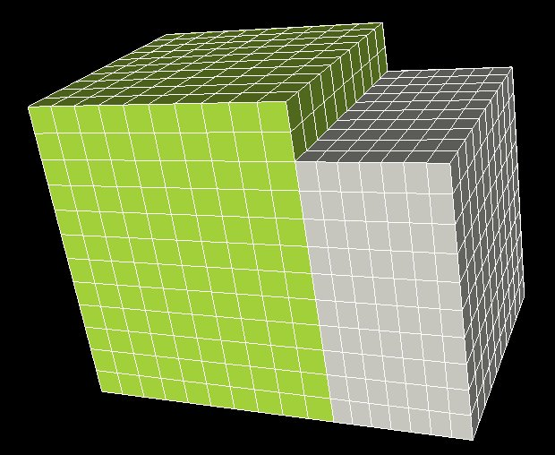

Documentation magix3D
=====================

| L'outil **magix3D** est un outil de modélisation / maillage 3D. 
| Dans ce contexte, il doit permettre de gérer à la fois des géométries 3D simples (sphères, cylindres, parallélépipèdes, etc.), des géométries 3D à symétrie de révolution ou des géométries issues de CAO importées au format Catia, IGES ou STEP.
| D'un point de vue maillage, l'objectif est de fournir l'approche la plus simple possible pour générer des maillages hexaédriques mais aussi des maillages mixtes composés d'hexaèdres, tétraèdres, pyramides et tout autre polyèdre.

Afin de permettre des études paramétrées et reproductibles, l'outil magix3D permet le **scripting Python** et toute session interactive est sauvée à l'aide d'un tel script. 
Enfin, dans le cadre de la simulation numérique, l'outil magix3D fonctionnera dans un contexte distribué afin de permettre la génération et la manipulation de
maillages sur un supercalculateur.

Documentation utilisateur
-------------------------

:doc:`pages/lancement`
   Lancement de l'outil magix3D

:doc:`pages/manuel-utilisateur`
   Documentation de l'IHM magix3D

:doc:`pages/api-python`
   Synthèse des commandes de l'API Python

:doc:`pages/methodologie`
   Méthodologie de construction d’un maillage

.. include:: cea_index-historique.rst

:doc:`pages/annexes`
    Documentation annexe

Documentation développeur
-------------------------

:doc:`pages/dev-mgx`
   Documentation magix3D générée à l'aide de Doxygen
   
.. _index-tutoriels:

Tutoriels
---------

:doc:`pages/tuto-2BoitesConformes`
   |deuxBoitesMaillage| Tutoriel qui explique comment réaliser le maillage conforme et structuré par blocs pour 2 boites 

:doc:`pages/tuto-2BoitesAvecRecouvrement`
   |deuxBoitesRPMaillage| Tutoriel qui explique comment réaliser le maillage conforme et structuré par blocs pour 2 boites avec un 
   recouvrement partiel

:doc:`pages/tuto-Groupes`
   |PlaqueEtCylindreMaille| Tutoriel qui montre comment utiliser les groupes

.. include:: cea_index-tuto.rst

.. Hidden TOCs

.. toctree::
   :caption: Documentation Utilisateur
   :maxdepth: 2
   :hidden:

   pages/lancement
   pages/manuel-utilisateur
   pages/api-python
   pages/methodologie
   pages/cea_historique
   pages/annexes

.. toctree::
   :caption: Documentation Développeur
   :maxdepth: 3
   :hidden:

   pages/dev-mgx
   
.. Tuto internes au cea préfixés par cea_

.. toctree::
   :caption: Wiki
   :maxdepth: 2
   :hidden:
   :glob:

   pages/tuto-2BoitesConformes
   pages/tuto-2BoitesAvecRecouvrement
   pages/tuto-Groupes
   pages/cea_tuto-*

