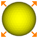
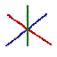
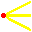
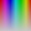
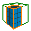
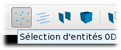

Barre d'outils
----------------

Boutons annuler et rejouer
~~~~~~~~~~~~~~~~~~~~~~~~~~

|image43|\ |image44|\ 

.. |image43| image:: ../images/image5.png
   :width: 0.25in
   :height: 0.25in

Voir les paragraphes :ref:`annuler` et :ref:`rejouer`.

Boutons d’importation et d’exportation
~~~~~~~~~~~~~~~~~~~~~~~~~~~~~~~~~~~~~~

|image45|\ |image46|\ |image47|\ 

.. |image45| image:: ../images/image7.png
   :width: 0.25in
   :height: 0.25in

.. |image46| image:: ../images/image9.png
   :width: 0.25in
   :height: 0.25in

.. |image47| image:: ../images/image10.png
   :width: 0.25in
   :height: 0.25in

Voir les paragraphes :ref:`importer`, :ref:`exporter`
et :ref:`exporter-cao`.

Boutons associés à la vue
~~~~~~~~~~~~~~~~~~~~~~~~~

|image48|\ |image49|\ |image50|\ |image51|\ |image52|\ |image53|\ |image54|\ |image55|\ |image56|\ |image57|\ 

.. |image48| image:: ../images/image13.png
   :width: 0.25in
   :height: 0.25in

.. |image49| image:: ../images/image15.png
   :width: 0.25in
   :height: 0.25in

.. |image50| image:: ../images/image17.png
   :width: 0.25in
   :height: 0.25in

.. |image51| image:: ../images/image18.png
   :width: 0.25in
   :height: 0.25in

.. |image52| image:: ../images/image19.png
   :width: 0.25in
   :height: 0.25in

.. |image57| image:: ../images/image24.png
   :width: 0.25in
   :height: 0.25in

Voir :ref:`menu-vue`.

.. _boutons-creation-maillage:

Boutons de création de maillage
~~~~~~~~~~~~~~~~~~~~~~~~~~~~~~~

|image58|\ |image59|\ |image60|\ 

.. |image59| image:: ../images/image26.png
   :width: 0.25in
   :height: 0.25in

.. |image60| image:: ../images/image27.png
   :width: 0.25in
   :height: 0.25in

Ces boutons permettent un accès rapide aux commandes de création de maillage.

Pour le fonctionnement, voir les paragraphes :ref:`mailler-selection`, 
:ref:`mailler-visible` et :ref:`tout-mailler`.

.. _boutons-selection:

Boutons associés au mode de sélection
~~~~~~~~~~~~~~~~~~~~~~~~~~~~~~~~~~~~~

L’utilisateur peut sélectionner de manière interactive des entités dans
la fenêtre graphique 3D. Cette sélection s’effectue par **clic du bouton
gauche** de la souris, ou par pression de la **touche P**, et concerne
l’entité localisée sous le curseur de la souris.

Dans l’hypothèse où plusieurs entités se trouvent sous le curseur de la
souris, celles-ci sont évaluées en fonction de leur distance à
l’observateur. On peut passer de l’une à l’autre à condition de ne pas
déplacer le curseur et d’appuyer sur la touche de tabulation (*tab*) ou
sur la touche d’espace (*space*), selon la valeur de la ressource
*Magix3D.gui.interactor. nextSelectionKey* (voir :ref:`preferences`). Le fait de presser simultanément la touche
*majuscule* (*shift*) provoque une évaluation en sens inverse.

Afin de faciliter le travail de sélection, le nombre d’entités affichées
étant potentiellement important, Magix3D propose 2 filtres accessibles
depuis la barre d’outils :

1. Un filtre sur la dimension des entités sélectionnables,

2. Un filtre sur la façon d’évaluer si une entité est sous le curseur ou
   non de la souris.

.. _filtre-dimension-entites:

Filtre sur la dimension des entités
^^^^^^^^^^^^^^^^^^^^^^^^^^^^^^^^^^^^^^

L’activation d’une des 4 icônes de filtrage des entités selon
leur dimension inhibe la sélection de toutes les entités qui ne sont pas
de cette dimension. Dans le cas de la figure précédente, seules les
entités de dimension 0 (points et sommets) sont sélectionnables.

Filtre sur la fonction d’évaluation des entités
^^^^^^^^^^^^^^^^^^^^^^^^^^^^^^^^^^^^^^^^^^^^^^^^^^

.. image:: ../images/image45.png
   :height: 0.9in

Lorsqu’une entité est évaluée afin de voir si elle est
sélectionnable, sa position peut être considérée de deux manières
différentes :

1. Evaluation de sa boite englobante,

2. Evaluation de sa représentation,

L’icône *mode de sélection* permet de passer d’un mode à l’autre.

* | L’évaluation de la boite englobante donne des résultats rapides et ne requiert pas de précision particulière. 
  | Elle est en revanche peu adaptée lorsque plusieurs entités se superposent car celles en position centrale deviennent peu accessibles.
* | L’évaluation de la représentation des entités revêt un intérêt particulier en mode filaire. 
  | Il devient ainsi possible de sélectionner au travers de surfaces matérialisées par des segments de droites. 
  | Ce mode présente l’inconvénient d’être moins performant.

