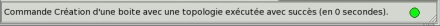

.. _barre-notification:

Barre de notification
---------------------

Cette barre de notification fait apparaître d’une part le dernier
message de Magix3D (en général le dernier du panneau historique), ainsi
qu’un bouton de l’état de la commande en cours. La convention de couleur
est la suivante :

-  Vert : la commande s’est terminée avec succès,

-  Orange clignotant : la commande est en cours d’exécution,

-  Rouge : la commande s’est terminée en erreur.

