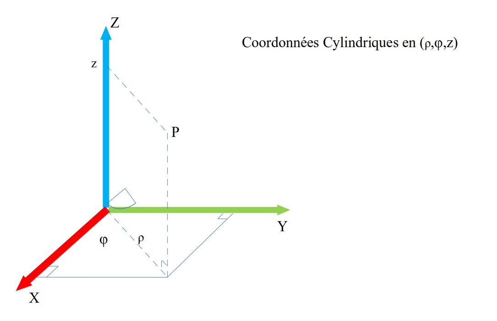
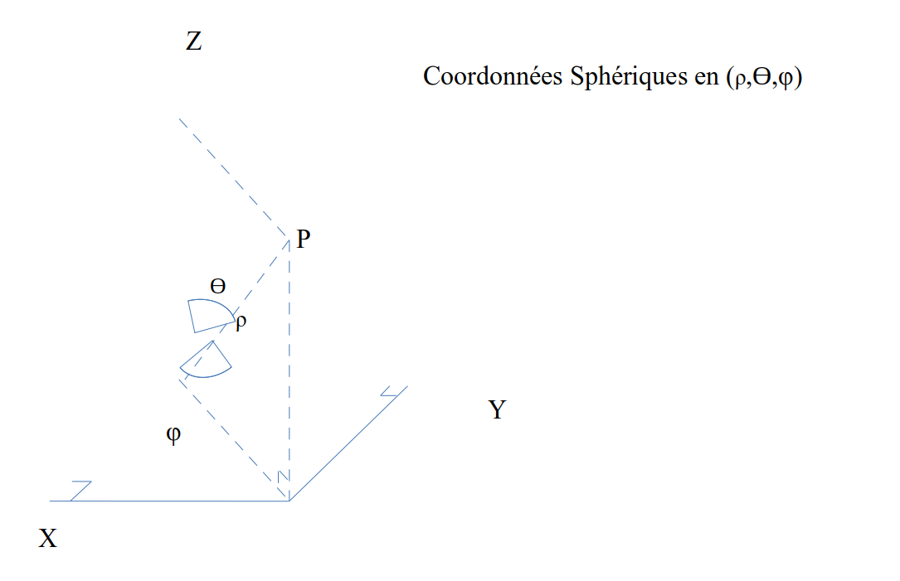

:orphan:

.. _conventions-reperes:

Conventions pour les repères
****************************

Les coordonnées des entités peuvent

-  D’une part être données dans un repère local, voir :ref:`operations-reperes`

-  D’autre part être renseignées en coordonnées cartésiennes,
   cylindriques ou sphériques.

Nous détaillons ici les conventions d’utilisation des différents types
de coordonnées.

