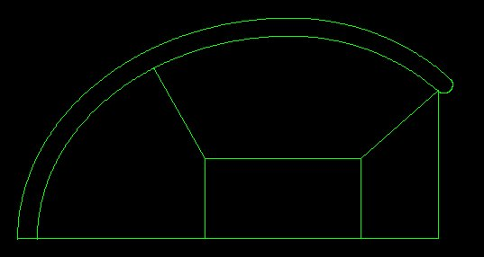

:orphan:

.. _generation3d:

Génération d un modèle 3D à partir d'un modèle 2D
*************************************************

Magix3D permet la construction d'une :ref:`géométrie<geometrie>` 3D par révolution d'un cas 2D, avec la possibilité de 
construire les blocs topologiques pour le cas 3D. Voir pour cela le tutoriel.

Règles
------

Pour la construction d'une topologie 3D à partir d'une topologie en 2D, cette dernière doit respecter certaines règles:

* Il est interdit d'avoir une face topologique (et donc une zone dans Magix) avec uniquement un sommet (extrémité) sur l'axe de symétrie. On ne tient pas compte des sommets internes à un côté. Ci dessous 2 cas interdits.

    Un seul sommet sur l'axe

    Un 2eme sommet sur l'axe, mais c'est un sommet interne

* Il n'est pas actuellement possible d'avoir plus qu'un niveau de faces sous le tracé de l'o-grid. Il est donc possible d'avoir un détail technologique sur l'axe et que celui-ci se retrouve sous ce tracé de l'o-grid. 

Ci-dessous un premier cas non accepté et un deuxième accepté.

    Cas avec 2 ou 1 face sous le tracé de l'o-grid

* Une face peut avoir :

    * soit 2 de ses sommets sur l'axe
    
    * soit aucun de ses sommets sur l'axe
    
    * soit ses 3 sommets sur l'axe (cas de la face dégénérée à 3 sommets)

    Cas acceptés

Recommandations
---------------

Il faut éviter d'importer un modèle 2D avec une décomposition en o-grid proche de l'axe. En effet, les contours du modèle 2D deviennent des surfaces par révolution et sont alors une contrainte pour la création des blocs structurés. Exemples de décomposition en 2D:

La dernière décomposition de la cavité donne par révolution entre autre une surface près de l'axe :

    Exemple de modélisation avec surface contraignante pour le 3D

ce qui contraint fortement la position de l'o-grid en 3D :

    Topologie associée avec o-grid trop près de l'axe

Si l'on continue avec cette géométrie et que l'on place l'o-grid entre l'axe et cette surface de révolution, on se retrouve

    * soit avec un maillage ayant trop peu de mailles suivant les secteurs de révolution

    .. figure:: ../images/ExempleCavite3D_petit_ogrid_maillage_lege.jpg
        :width: 680px
    
        Trop peu de mailles sur le pourtours

    * soit avec un maillage ayant trop de mailles dans le bloc central 

    .. figure:: ../images/ExempleCavite3D_petit_ogrid_maillage_lourd.jpg
        :width: 680px

        Trop de mailles au centre

Idéalement il faut partir de la première topologie 2D (quitte à simplifier votre cas pour le passage au 3D) :

    Cavite sans o-grid

et ainsi obtenir un ensemble de blocs raisonnablement répartis :

    
    Cavité avec o-grid idéal

ce qui permet d'obtenir le maillage suivant :

    
    Cavité avec maillage idéal 