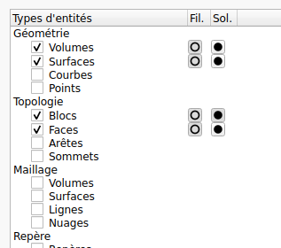

.. _gestion-entites:

Gestionnaire d'entités
======================

.. _onglet-groupes:

Onglet Groupes
--------------

Cet onglet est le moyen le plus simple pour sélectionner les
entités à afficher dans le panneau de représentation.

En utilisant le menu contextuel (bouton droit de la souris), il permet
également de sélectionner ou de désélectionner certaines de ces entités
suivant le fait qu’elles soient à afficher. Il est aussi possible de
modifier la représentation d’un ensemble de types d’entités.

Cet onglet se décompose en 2 parties, en haut les types d’entités et en
bas les groupes rassemblés par dimension.

La partie « **Types d’entités** » permet d’activer ou non la
représentation des entités suivant leur type. Les secondes et troisièmes
colonnes des surfaces, volumes, cofaces et blocs permettent par clic du
bouton gauche de faire apparaître un menu contextuel controlant le
mode d'affichage (filaire/isofilaire/surfacique) des entités 
correspondantes.

La partie « **Groupes** » permet de sélectionner les groupes (nom de
volume par exemple, nom de matériau) à afficher.

L'option **Propager l'affichage** lorsqu'elle est active entraine la
représentation des entités de dimension inférieure dès lors qu'elles
font partie d'un groupe à afficher.

Les Types d’entités
^^^^^^^^^^^^^^^^^^^

Il est non seulement possible d’activer la représentation d’un type
particulier d’entités, mais il est également possible de sélectionner
soit toutes les entités, soit celles visibles, pour un type donné. Il
est aussi possible d’agir sur la représentation des entités de ce type.

Les Groupes
^^^^^^^^^^^

Les groupes peuvent être des regroupements d’entités géométriques,
topologiques ou des sous-ensembles du maillage, mais il ne peut y avoir
de mélange de type dans un même matériau. Ils peuvent correspondre à une
pièce mécanique, à un matériau ou tout autre chose. Ils sont là pour
permettre d’identifier des ensembles d’entités au sens large et d’agir
sur leur représentation, leur sélection.

Il est prévu de séparer les groupes suivant différents niveaux pour
aider à s’y retrouver pour les cas avec beaucoup de groupes. Aussi le
menu contextuel permet d’activer la « vue multi-niveaux ». Il ensuite
possible de changer des groupes de niveaux. L’idée étant de mettre dans
un même niveau des groupes de signification (volumes élémentaires,
matériaux, regroupements de matériaux...). Vous avez une totale liberté
sur son utilisation....

.. _onglet-entites:

Onglet Entités
--------------

Cet onglet permet d'accéder aux entités suivant leur nom.

Les entités sont simplement réparties suivant leur type et leur
dimension.

Les entités peuvent être rendues visibles ou non, individuellement ou
par groupe.

Un menu contextuel permet la modification de la représentation de la
sélection.

.. _onglet-pointages-laser:

Onglet Pointages laser
----------------------

Cet onglet dispose d’un menu contextuel (bouton droit de la souris)
équivalent à ce que l’on trouve dans le :ref:`menu-chambre-experimentale`. 
Ce menu tient compte des entités sélectionnés lors de son
ouverture.

Les pointages laser sont en général regroupés par anneau.

Ce panneau dispose de cases à cocher qui permettent d’activer ou non la
représentation des pointages laser, des taches et des diagnostics. Le
regroupement par anneau permet d’avoir des actions par anneau ou par
pointage. La sélection d’un anneau provoque automatiquement celle des
pointages laser qui le composent.

En faisant survoler le curseur de la souris quelques secondes sur une
entité une bulle contenant sa description (coordonnés et angles dans les
différents repères, ...) apparait. Dans le cas où l’entité est un anneau
la description correspond aux valeurs moyennes des pointages laser qui
le composent.
