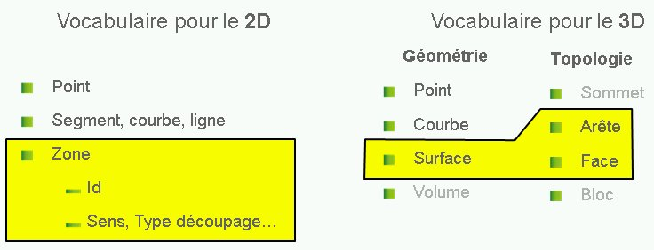
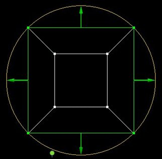
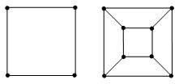
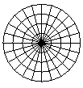
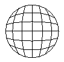
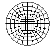
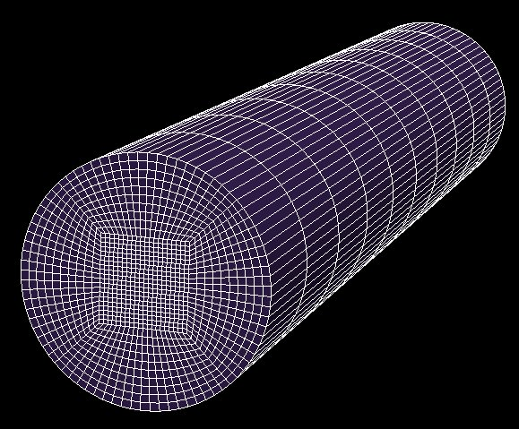

Glossaire
#########

.. _geometrie:

Géométrie
*********

La géométrie, ou modélisation, est ce qui constitue ce que l'on souhaite modéliser. Elle est constituée des entités suivantes par ordre de dimension :

 * points
 * courbes
 * surfaces
 * volumes

Habituellement, elle délimite chacun des matériaux, ou pièces, du modèle. On trouve parfois des entités qui subdivisent le modèle pour des facilités de maillage. 

.. _topologie:

Topologie
*********

La topologie esr ce qui permet de définir le maillage à réaliser à partir d'une :ref:`géométrie<geometrie>`.
La topologie est définie par des sommets reliés par des arêtes.
Les faces topologiques sont définies par un ensemble fermé d'arêtes.
Les blocs topologiques sont définis par un ensemble fermé de faces.
Une discrétisation est associée à chacune des arêtes(uniforme, géométrique, ...)
Une face et un bloc topologique ont chacun leur méthode de discrétisation (transfinie, suivant une direction, avec une méthode non structurée type Delaunay par exemple).

Cette notion de topologie apparait déjà en 2D avec Magix mais elle est intégrée dans la définition des zones.

Vocabulaire
***********

Les termes utilisés en 2D et en 3D diffèrent.
* les points, pareil en 2D et en 3D;
* les segments, courbes et lignes du 2D sont des courbes en 3D;
* les zones en 2D sont plus qu'une entité géométrique, il y a d'une part l'équivalent de la surface en 3D, mais en plus il y a une description des contours logiques, des descriptions des discrétisations ainsi que les groupes.

Vue schématique de cette correspondance: correspondance entre 2D et 3D

En 3D, nous avons fait apparaitre la notion de topologie, notion implicite dans la description des zones de Magix en 2D.

Exemple pour un disque avec une décomposition en 5 faces topologiques, on a alors :

* 4 sommets associés à une même courbe
* 4 sommets associés à une surface
* 4 arêtes associées à cette courbe
* 8 autres arêtes associées à la surface

Avec comme convention de couleur:

* Sans association : cyan
* Association avec une courbe : vert
* Association avec une surface : blanc

.. _o-grid:

O-grid
******

On parle d’o-grid pour la décomposition de blocs topologiques en sous-blocs par insertion d’un bloc au centre. En 2D, cela s’effectue en décomposant 1 bloc en 5 blocs :

Le maillage d'un disque peut être maillé avec une structuration par blocs de 3 façons représentées ici:

On constate que, dans le 1er cas avec dégénérescence en un point, la connectivité autour du nœud central est très importante. Ce cas est préférable pour un écoulement radial et à éviter pour ceux qui sont orthogonaux au plan.

Dans le 2 :sup:`ème` cas, les mailles aux extrémités du bloc topologiques sont très aplaties. Le 3ème cas permet, avec l’o-grid, d’obtenir des mailles adaptées aux écoulements orthogonaux au plan.

En 3D, un o-grid consiste à décomposer un bloc en 7 sous-blocs, un premier au centre et les 6 autres reliant chacune des faces d’un bloc à celle lui faisant face sur le bloc initial. Ce découpage topologique permet la construction de blocs adaptés à des hexaèdres pour un objet de révolution (avec des hexaèdres sur l’axe).

Cette décomposition en o-grid en 3D permet ainsi d'éviter

* soit les mailles à forte connectivité :

    .. image:: ../images/ExempleCavite3D_O0_zoom.jpg
          :width: 200px

* soit les mailles plates :

    .. image:: ../images/Exemple_maille_plates.jpg
        :width: 200px

Et l'on obtient un compromis avec des hexaèdres réguliers autour de l'axe de symétrie :

