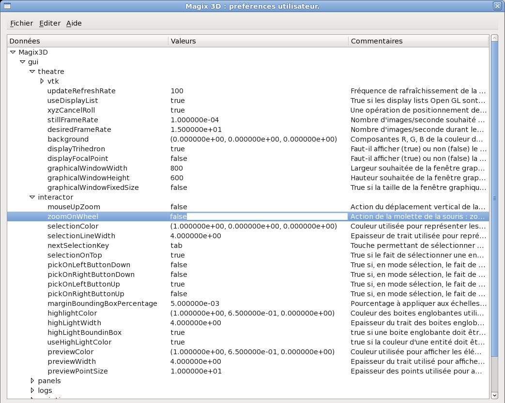
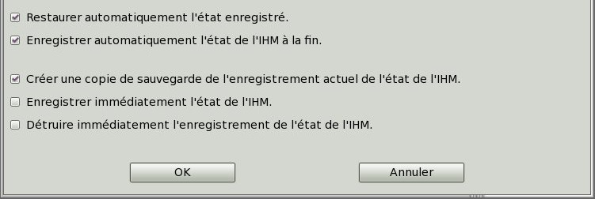

.. _menu-projet:
   
Menu Projet
~~~~~~~~~~~

Préférences
^^^^^^^^^^^

L’utilisateur a moyen, via un fichier de **ressources**, de paramétrer
certains aspects de Magix3D : couleurs, interactions, et autres aspects
plus techniques.

Lors de son lancement, Magix3D charge une première version commune à
tous les utilisateurs de ce fichier de ressources. Puis il charge, s’il
existe, le fichier *~/.magix3d* de l’utilisateur, ce qui aura pour effet
d’écraser les valeurs par défaut des différentes ressources.

L’utilisateur peut à tout moment, lors d’une session Magix3D, modifier
ses ressources, via le menu *Projet/Préférences…*. L’activation de cet
item provoque l’affichage d’une boite de dialogue d’édition des
ressources (voir figure ci-après). Ces ressources sont regroupées de
manière thématique dans une arborescence de **sections**, composées de
sous-sections et/ou ressources.

Chaque ressource est caractérisée par son nom (colonne Données), sa
valeur, et un éventuel commentaire la décrivant.

La modification d’une ressource s’effectue comme suit :

-  Activation du champ de texte d’édition de sa valeur, par double-clic,

-  Modification du texte,

-  Validation de la modification par retour-chariot.

Pour une prise d’effet immédiate dans Magix3D des modifications
apportées, il faut alors activer l’item *Fichier.Appliquer* du menu de
la boite de dialogue. Cela ne concerne que la session courante de
Magix3D. Pour que les modifications soient utilisables lors des
prochaines sessions de Magix3D il convient d’activer l’item
*Fichier.Enregistrer* de cette même boite de dialogue, ce qui aura pour
effet d’enregistrer cette configuration dans le fichier *~/.magix3d*.

Voir :ref:`preferences` pour de plus amples informations sur le contenu du
fichier de préférences.

Etat de l’IHM
^^^^^^^^^^^^^

Ce menu *Projet/Etat de l’IHM...* vous permet par défaut de retrouver
l’IHM de Magix3D dans l’état qu’elle était lors de la fermeture. Il vous
est également offert la possibilité de détruire cette sauvegarde pour
revenir à l’état par défaut.

Quitter
^^^^^^^

L’action *Projet/Quitter...* dispose du raccourci CTRL+Q ce qui permet
d’accéder à cette action pour quitter l’application après une
confirmation.
La demande de confirmation pour quitter l'application peut être
désactivée en affectant *false* à la ressource 
*Magix3D.gui.confirmQuitAction*.

