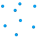
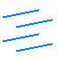

.. _menu-selection:

Menu Sélection
~~~~~~~~~~~~~~

Ce menu permet essentiellement d’agir sur la sélection.

.. only:: html
   
   Voir :ref:`selection` pour la méthodologie de sélection des entités. 

Afficher/Masquer les entités sélectionnées
^^^^^^^^^^^^^^^^^^^^^^^^^^^^^^^^^^^^^^^^^^^^^^^^^^^^^^^^^

Ces 2 actions permettent d’afficher ou de masquer, dans le panneau de
représentation, les entités sélectionnées.

Afficher/Masquer les groupes sélectionnés
^^^^^^^^^^^^^^^^^^^^^^^^^^^^^^^^^^^^^^^^^^^^^^^^^^^^^^^^

Ces 2 actions permettent d’afficher ou de masquer les groupes
sélectionnés depuis le panneau de gestion des entités. Cela est
équivalent aux actions pour afficher ou masquer disponibles dans le menu
contextuel associé aux groupes.

.. _afficher-entites-types-selectionnes:

Afficher/Masquer les entités de types sélectionnés
^^^^^^^^^^^^^^^^^^^^^^^^^^^^^^^^^^^^^^^^^^^^^^^^^^^^^^^^^^^^^^^^

Ces 2 actions permettent d’afficher ou de masquer les types d’entités
(Volumes, Surfaces...) sélectionnés depuis le panneau de gestion des
entités. Cela est équivalent aux actions pour afficher ou masquer
disponibles dans le menu contextuel associé aux types d’entités.

.. _afficher-ou-non-proprietes:

Afficher ou non les propriétés des entités sélectionnées
^^^^^^^^^^^^^^^^^^^^^^^^^^^^^^^^^^^^^^^^^^^^^^^^^^^^^^^^

Cette option, activée par défaut, active l’affichage des propriétés de
la sélection dans :ref:`onglet-proprietes-individuelles` 
et :ref:`onglet-proprietes-communes`.

.. _calculer-ou-non-proprietes:

Calculer ou non certaines des propriétés des entités sélectionnés
^^^^^^^^^^^^^^^^^^^^^^^^^^^^^^^^^^^^^^^^^^^^^^^^^^^^^^^^^^^^^^^^^

Cette option, non activée par défaut, entraine le calcul (souvent long) 
de certaines propriétés comme le volume ou la boite englobante de la
sélection dans :ref:`onglet-proprietes-individuelles` 
et :ref:`onglet-proprietes-communes`.

.. _representations:

Représentations
^^^^^^^^^^^^^^^

Ce menu permet de modifier la représentation pour toutes les entités du
type de celles sélectionnées (ou seulement pour celles sélectionnées
suivant option *Vue/Utilisation des propriétés d’affichage globales*).

Ce menu dépend du type d’entités auquel il s’applique. On y retrouve
suivant les cas l’affichage optionnel :

-  Points, permet de visualiser ou non les points associés (les nœuds
   pour les arêtes).

-  Filaire, permet de visualiser les contours curvilignes (les contours
   pour les surfaces et volumes).

-  Isofilaire, permet de visualiser les surfaces autrement que par les
   bords (qui se chevauchent).

-  Surfaces, permet de visualiser en mode dit surfacique (plein et non
   filaire).

-  Volumes, permet de représenter les mailles internes des volumes de
   maillage.

-  Associations, fait apparaitre une flèche entre l’entité topologique
   et l’entité géométrique sur laquelle elle est projetée.

-  Topologie projetée, permet de faire apparaitre les arêtes non plus
   comme des droites mais comme des lignes brisées qui sont positionnées
   tel que sera le maillage de ces dernières.

-  Type de discrétisation, permet de faire apparaitre un symbole pour
   identifier le type de discrétisation des arêtes, des faces et des
   blocs.

-  Nombre de bras de la discrétisation, permet de faire apparaitre le
   nombre de bras pour les arêtes.

Dans tous les cas, apparaissent au début le mode (propriétés d’affichage
globales ou individuelles), et à la fin il est proposé une modification
de la police de caractères et des couleurs pour le texte (utilisé pour
le nombre de bras).

Convention de couleur pour les projections : 

-  Cyan lorsqu’il n’y a pas d’association

-  Marron pour une association vers une entité géométrique de dimension
   0 (sommet)

-  Vert pour une association vers une entité géométrique de dimension 1
   (courbe)

-  Blanc pour une association vers une entité géométrique de dimension 2
   (surface)

.. _selectionner-entites:

Sélectionner des entités
^^^^^^^^^^^^^^^^^^^^^^^^

Ce menu est disponible également avec le raccourci **CTRL+F**. Il permet
de sélectionner une entité à partir de son nom (exemple : *Surf0001*).

Il est alors possible de rendre cette sélection visible (en laissant
coché « Afficher la sélection »). C’est un moyen efficace pour
identifier un bloc dont le maillage serait signalé comme anormal.

Il est possible d’ajouter les entités à la sélection ou de remplacer par
cette nouvelle sélection.

.. _selection-suivant-critere:

Sélection/Désélection suivant un critère
^^^^^^^^^^^^^^^^^^^^^^^^^^^^^^^^^^^^^^^^

Ces actions permettent d’ajouter ou d’enlever de la sélection des
entités suivant l’un des critères suivant :

-  Entités visibles, ne tient pas compte de actions individuelles où une
   entité à pu être masqué, mais tient compte du filtre lié aux groupes
   et types d’entités actifs.

-  Arêtes fusionnables, permet d’identifier les arêtes dites
   fusionnables car associées à une même courbe et présentes dans les
   mêmes faces. Ces arêtes pourront être ensuite fusionnées à l’aide de
   la commande :ref:`fusion-aretes`.

-  Faces aux bords, permet d’identifier les faces qui ne sont pas entre
   2 blocs, donc les faces externes à notre modèle mais également les
   faces internes pour lesquels il serait nécessaire de faire une fusion
   topologique des sommets. Si l’on souhaite mettre une condition de
   glissement sur une surface, il est alors possible de laisser 2 faces
   pointer sur une même surface.

-  Faces semi-conformes, permet d’identifier les faces pour lesquelles
   il sera certainement nécessaire d’indiquer dans le jeu de données la
   présence d’une semi-conformité du maillage.

-  Faces invalides, ce sont les faces qui ne peuvent pas être maillées.
   Il s’agit en général d’un problème de structuration avec pour une
   face des nombres de bras différents entre 2 côtés logiques opposés.

-  Faces non-structurées, ce sont les faces qui ont une méthode de
   maillage non-structurée.

-  Faces avec méthodes Transfinie, ce sont les faces qui ont la méthode
   de maillage structurée transfinie. Celle-ci est plus coûteuse en
   temps de réalisation du maillage et parfois moins régulière qu’une
   méthode telle que la méthode directionnelle ou suivant une rotation.

-  Blocs invalides, comme pour les faces.

-  Blocs non-structurés, comme pour les faces.

-  Blocs avec méthodes Transfinie, comme pour les faces.

Sélection d'entités selon la dimension
^^^^^^^^^^^^^^^^^^^^^^^^^^^^^^^^^^^^^^

|dim0|\ |dim1|\ |dim2|\ |dim3|\

Pour permettre la sélection d’entités, il est nécessaire de sélectionner la dimension des entités
que l’on souhaite sélectionner. Voir la description des :ref:`boutons-selection`.

Les panneaux de commandes sélectionnent automatiquement les ou les
dimensions adaptées lorsqu’il s’agit de remplir un des champs.

Mode de sélection des entités
^^^^^^^^^^^^^^^^^^^^^^^^^^^^^

|selection|

.. |selection| image:: ../images/image36.png
   :width: 0.25in
   :height: 0.25in

Voir la description :ref:`boutons-selection`.

Il recommandé d’utiliser le mode de sélection filaire, proposé par
défaut.

Le mode plein sera un peu mieux adapté (plus rapide) pour des entités
représentées en mode volumique (volumes de mailles, volumes géométriques
en représentation surfacique...).

