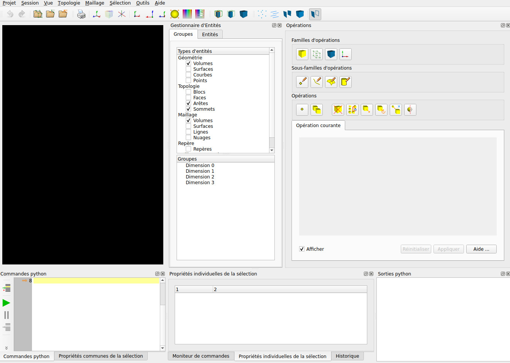
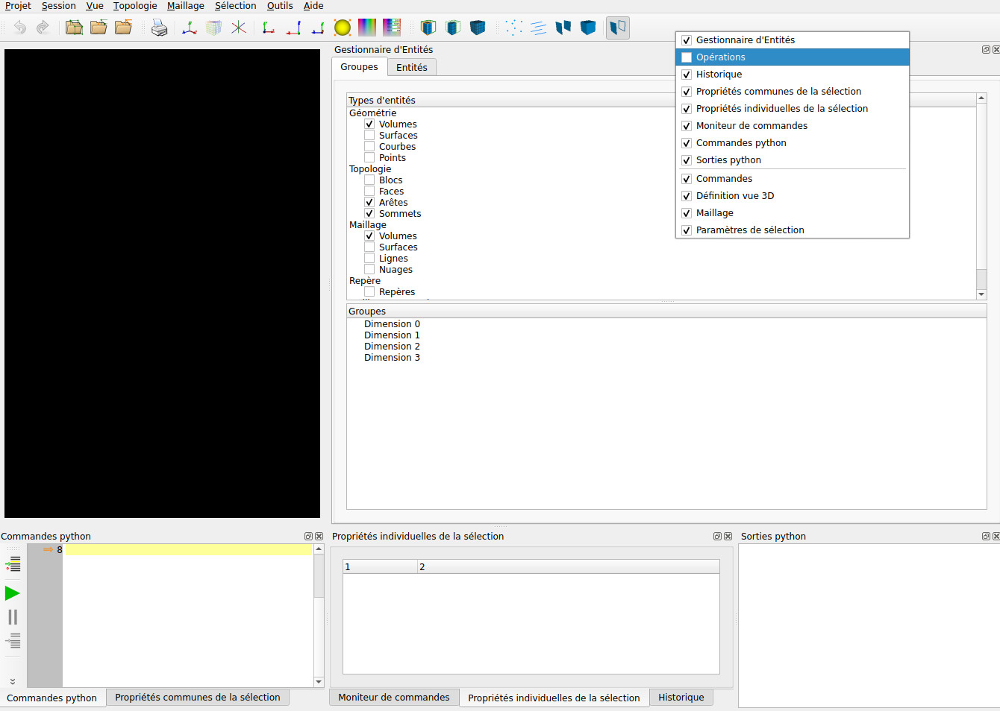

.. _modification-aspect:

:orphan:

Modification de l'aspect de l'IHM
*********************************

Lors du lancement de l'outil Magix3D, la fenêtre graphique obtenue ressemble à celle-ci : 

On notera que le panneau **Commandes python** a déjà été déplacé. Pour cela, il suffit de faire glisser ce panneau à l'aide de votre souris.

Il est possible de fermer un panneau, ce qui est le cas pour celui des **Opérations** ici : 

Pour faire réapparaitre un panneau fermé, il suffit d'utiliser le menu obtenu avec le bouton droit dans une zone inutilisée (comme par exemple la partie droite du menu) : 

Les tailles des différents panneaux et leurs positions sont par défaut sauvegardées.

Ces options de sauvegarde sont paramétrées dans le menu *Projet/Etat de l'IHM...* 