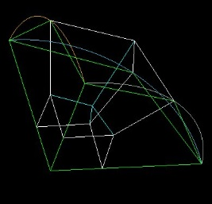
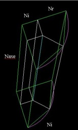
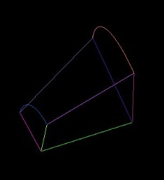
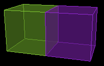

.. _operations-geometriques:

Opérations géométriques
~~~~~~~~~~~~~~~~~~~~~~~

Il est proposé un nom de groupe lors de la création d’entités
géométriques, ce nom permettra de mieux identifier les différents
matériaux et leur représentation, voir :ref:`creation-bloc-volume`.

Les commandes de création d’entités géométriques impliquent la création
des entités de niveaux inférieurs (les sommets, courbes et surfaces sont
créés avec un volume).

Il est optionnellement possible de créer une topologie associée à un
nouveau volume.

Opérations communes aux entités géométriques de différentes dimensions
^^^^^^^^^^^^^^^^^^^^^^^^^^^^^^^^^^^^^^^^^^^^^^^^^^^^^^^^^^^^^^^^^^^^^^
.. _creation-par-revolution:

Créer une entité géométrique par révolution |image92|
''''''''''''''''''''''''''''''''''''''''''''''''''''''

Ce panneau est proposé pour les entités suivant les
différentes dimensions (1D, 2D et 3D).

Il faut renseigner les noms des entités qui servent de base pour
l’extrusion.

Il faut également renseigner l’angle de rotation suivant des valeurs
soit prédéfinies (demi pour 180°) soit suivant un nombre de degrés
souhaité.

L’axe de rotation est par défaut l’axe des X mais il est possible d’en
sélectionner un autre (axe des Y ou Z, voir même un axe défini par une
courbe ou par deux points).

Il est possible de conserver les entités initiales.

.. _copie-entites-geometriques:

Copier des entités géométriques |image68|
''''''''''''''''''''''''''''''''''''''''''

Ce panneau est proposé pour les entités suivant les
différentes dimensions.

Il faut renseigner les noms des entités à dupliquer, sachant que la
copie d’une entité implique la copie de celles de dimensions inférieures
qui sont liées.

Il est proposé de copier la topologie. Si c’est le cas, alors la
topologie copiée sera associée aux entités géométriques dupliquées.

Le nom du groupe sélectionné sera celui dans lequel seront mises les
entités dupliquées. Et s’il n’y a pas de nom de groupe, elles resteront
dans leurs groupes initiaux.

.. _destruction-entites-geometriques:

Détruire des entités géométriques |image69|
''''''''''''''''''''''''''''''''''''''''''''

Ce panneau est proposé pour les entités suivant les
différentes dimensions.

Il faut renseigner les noms des entités à détruire.

Une option vous permet de préciser si la destruction d’une entité
implique la destruction de celles de dimensions inférieures qui sont
liées.

La topologie peut être soit détruite, soit perdre ses associations vers
les entités géométriques détruites.

.. _ajout-groupe:

Ajouter/supprimer/affecter des entités géométriques à un groupe |image70|
'''''''''''''''''''''''''''''''''''''''''''''''''''''''''''''''''''''''''

Ce panneau est proposé pour les entités suivant les
différentes dimensions.

Il est possible soit d’ajouter, soit d’enlever ou soit d’affecter, un
nom de groupe (qui peut être vide) à un ensemble d’entités (de même
dimension) dont il faut renseigner les noms.

C’est un moyen d’identifier un ensemble d’entités, ce qui a pour intérêt
d’être capable d’effectuer des opérations dessus, de restreindre les
entités représentées, de créer un groupe pour le maillage...

.. _translation-entites-geometriques:

Réaliser une translation d'entités géométriques |image71| 
'''''''''''''''''''''''''''''''''''''''''''''''''''''''''

Ce panneau est proposé pour les entités suivant les
différentes dimensions.

Il faut renseigner les noms des entités à translater, sachant que la
translation d’une entité implique la translation de celles de dimensions
inférieures qui sont liées.

Il faut également renseigner le vecteur pour la translation. Ce vecteur
peut être initialisé avec une arête topologique ou plus généralement
avec 2 points.

Si des entités topologiques sont reliées à ces entités géométriques,
alors elles subissent cette translation.

Attention, une entité topologique ne peut subir de translation si elle
est maillée.

Néanmoins, il est possible de translater toutes les entités
géométriques, dans ce cas le maillage peut être déjà réalisé et subira
la translation.

L’option de copie de la sélection permet d’effectuer la translation
d’une copie de la sélection. Il est alors possible de spécifier un nom
de groupe et si l’on souhaite copier également la topologie (comme pour
la commande :ref:`copie-entites-geometriques`).

.. _rotation-entites-geometriques:

Réaliser une rotation d'entités géométriques |image72|
'''''''''''''''''''''''''''''''''''''''''''''''''''''''

Ce panneau est proposé pour les entités suivant les
différentes dimensions.

Il faut renseigner les noms des entités à tourner, sachant que la
rotation d’une entité implique la rotation de celles de dimensions
inférieures qui sont liées.

Il faut également renseigner l’angle de rotation suivant des valeurs
soit prédéfinies (demi pour 180°) soit suivant un nombre de degrés
souhaité.

L’axe de rotation est par défaut l’axe des X mais il est possible d’en
sélectionner un autre (axe des Y ou Z, voir même un axe défini par une
courbe ou par deux points). Il est également possible de définir la
rotation à partir de points.

Si des entités topologiques sont reliées à ces entités géométriques,
alors elles subissent cette rotation.

Attention, une entité topologique ne peut subir de rotation si elle est
maillée.

Néanmoins, il est possible de faire la rotation de toutes les entités
géométriques, dans ce cas le maillage peut être déjà réalisé et subira
la rotation.

L’option de copie de la sélection permet d’effectuer la rotation d’une
copie de la sélection. Il est alors possible de spécifier un nom de
groupe et si l’on souhaite copier également la topologie (comme pour la
commande :ref:`copie-entites-geometriques`).

.. _homothetie-entites-geometriques:

Réaliser une homothétie d’entités géométriques |image73|
'''''''''''''''''''''''''''''''''''''''''''''''''''''''''

Ce panneau est proposé pour les entités suivant les
différentes dimensions.

Il faut renseigner les noms des entités à grossir ou diminuer, sachant
que l’homothétie d’une entité implique l’homothétie de celles de
dimensions inférieures qui sont liées.

Il faut également renseigner le rapport d’homothétie ainsi que le
centre. Ce centre peut être initialisé avec un sommet géométrique.

Si des entités topologiques sont reliées à ces entités géométriques,
alors elles subissent cette homothétie.

Attention, une entité topologique ne peut subir d’homothétie si elle est
maillée.

Néanmoins, il est possible de faire l’homothétie de toutes les entités
géométriques, dans ce cas le maillage peut être déjà réalisé et subira
l’homothétie.

L’option de copie de la sélection permet d’effectuer l’homothétie d’une
copie de la sélection. Il est alors possible de spécifier un nom de
groupe et si l’on souhaite copier également la topologie (comme pour la
commande :ref:`copie-entites-geometriques`).

.. _symetrie-entites-geometriques:

Réaliser une symétrie d’entités géométriques |image74|
'''''''''''''''''''''''''''''''''''''''''''''''''''''''

Ce panneau est proposé pour les entités suivant les
différentes dimensions.

Il faut renseigner les noms des entités à symétriser, sachant que la
symétrie d’une entité implique la symétrie de celles de dimensions
inférieures qui sont liées.

Il faut également renseigner le plan de symétrie. Il est défini par un
centre et un vecteur normal au plan.

Si des entités topologiques sont reliées à ces entités géométriques,
alors elles subissent cette symétrie.

Attention, une entité topologique ne peut subir de symétrie si elle est
maillée.

L’option de copie de la sélection permet d’effectuer la symétrie d’une
copie de la sélection. Il est alors possible de spécifier un nom de
groupe et si l’on souhaite copier également la topologie (comme pour la
commande :ref:`copie-entites-geometriques`).

.. _coupe-plan-entites-geometriques:

Couper des entités géométriques par un plan  |image98|
''''''''''''''''''''''''''''''''''''''''''''''''''''''

Ce panneau est proposé pour les entités suivant les
différentes dimensions (2D et 3D).

La coupe est définie par un point et une normale. Ces 2 paramètres
peuvent être remplis respectivement à l’aide d’un sommet géométrique et
d’une arête topologique.

Il faut renseigner les noms des entités à couper, sachant que la coupe
d’une entité implique la coupe de celles de dimensions inférieures qui
sont liées.

L’option *Aperçu* permet de visualiser la position du plan dans le
panneau de représentation.

Opérations associées aux points géométriques
^^^^^^^^^^^^^^^^^^^^^^^^^^^^^^^^^^^^^^^^^^^^

Sélectionner la sous-famille d’opérations associés aux points
géométriques avec |image66|

.. _creation-point:

Créer un point |image67|
'''''''''''''''''''''''''

Le panneau de création d’un sommet géométrique propose les
méthodes suivantes :

1. *Par saisie des coordonnées*, il est alors possible de renseigner les
   coordonnées à la main. Il est également possible de remplir les
   champs à partir d’un sommet existant.

2. *Par projection d’un point sur une courbe*, il faut alors renseigner
   d’une part le nom du point à projeter et d’autre part le nom de la
   courbe sur laquelle se fait la projection.

3. *Par projection d’un point sur une surface*, il faut alors renseigner
   d’une part le nom du point à projeter et d’autre part le nom de la
   surface sur laquelle se fait la projection orthogonale.

4. *Par saisie d’une abscisse curviligne*, il faut alors renseigner
   d’une part le nom de la courbe concernée et d’autre part une abscisse
   curviligne (entre 0 et 1).

5. *Suivant un ratio entre 2 points*, le point créé est placé sur la
   droite passant par deux points à renseigner.

6. *A partir d'un sommet topologique*, le point est créé à l'emplacement
   du sommet topologique sélectionné, et ce dernier est associé au point
   géométrique créé si la case correspondante est cochée.

Opérations associées aux courbes géométriques
^^^^^^^^^^^^^^^^^^^^^^^^^^^^^^^^^^^^^^^^^^^^^

Sélectionner la sous-famille d’opérations associés aux courbes
géométriques avec |image75|

.. _creation-segment:

Créer un segment |image76|
'''''''''''''''''''''''''''''

Se fait avec la méthode par *saisie des extrémités*, il faut
donc sélectionner les noms de deux sommets aux extrémités.

.. _creation-arc-cercle:

Créer un arc de cercle |image77|
''''''''''''''''''''''''''''''''''

Se fait avec l’une des méthodes suivantes :

1. *Par saisie d’un centre et des 2 extrémités*. Il faut donc saisir les
   noms de 3 sommets. Se fait par défaut dans un plan orthogonal à l’axe
   des Z. Il est possible de se placer dans un autre plan, pour cela il
   suffit de définir une normale au plan. Il est possible d’inverser le
   sens pour l’arc.

2. *Par sélection d’un repère local, de deux angles et d’un rayon.*
   L’arc est créé dans le plan (xOy) du repère local. Les angles sont
   pris par rapport à l’axe (Ox) et sont exprimés en degrés.

La fonction *Aperçu* permet de visualiser la normale au plan de
construction lorsqu’il est sélectionné un autre plan que le plan par
défaut (xOy), ainsi que l’arc en cours de construction.

.. _creation-cercle:

Créer un cercle / une ellipse |image78| 
''''''''''''''''''''''''''''''

Se fait avec la méthode de *saisie de 3 points*.

Construit soit un cercle passant par les noms de 3 sommets fournis, 
soit une ellipse centrée sur le sommet Centre, où :

- le plan de l'ellipse est défini par Centre, Point 1 et Point 2,
- son grand axe est défini par Centre et Point 1,
- son grand rayon est la distance entre Centre et Point 1, et
- son petit rayon est la distance entre Point 2 et l'axe principal.

.. _creation-courbe-par-projection:

Créer une courbe par projection orthogonale d'une courbe sur une surface |image79|
'''''''''''''''''''''''''''''''''''''''''''''''''''''''''''''''''''''''''''''''''''''''

Se fait en saisissant les noms de la courbe à projeter et
celui de la surface sur laquelle est effectuée la projection.

.. _collage-courbes:

Coller des courbes géométriques |image82|
'''''''''''''''''''''''''''''''''''''''''

Cette fonction permet d’unir des courbes. Pour cela saisir
les noms des courbes.

Cette union de courbes permet à une arête d’être associée à un groupe de
courbes sans avoir de contrainte (sinon il faudrait couper l’arête et
associé le sommet topologique au sommet géométrique commun entre les 2
courbes).

.. _intersection-courbes:

Réaliser l'intersection de 2 courbes |image84|
''''''''''''''''''''''''''''''''''''''''''''''''

Ce panneau permet d’obtenir la construction d’un point à
l’intersection de 2 courbes. Il est possible d’activer la conservation
des entités initiales (une copie est faite au préalable), sinon les
courbes initiales sont détruites.

Il est nécessaire de renseigner un nom de groupe pour y mettre l’entité
créée.

Opérations associées aux surfaces géométriques
^^^^^^^^^^^^^^^^^^^^^^^^^^^^^^^^^^^^^^^^^^^^^^

Sélectionner la sous-famille d’opérations associés aux surfaces
géométriques avec |image90|

.. _creation-surface:

Créer une surface |image91|
'''''''''''''''''''''''''''''

La création d’une surface à partir de courbes se fait en sélectionnant
un ensemble fermé de courbes coplanaires. La difficulté réside dans le
fait qu’il faut des courbes jointives (à une tolérance près).

.. _copie-surface-distance:

Créer une surface à une distance |image94|
''''''''''''''''''''''''''''''''''''''''''''

Ce panneau permet de construire une surface à une certaine
distance d’une autre. La taille de cette dernière n’est pas forcément la
même. Seule la distance avec la première compte.

.. _collage-surfaces:

Coller des surfaces géométriques |image95|
''''''''''''''''''''''''''''''''''''''''''

Cette fonction permet d’unir des surfaces. Pour cela saisir
les noms des surfaces.

Cette union de surfaces permet à une face d’être associée à un groupe de
surfaces sans avoir de contrainte (sinon il faudrait couper la face et
associé l’arête topologique à la courbe géométrique commune entre les 2
surfaces).

.. _intersection-surfaces:

Réaliser l'intersection de 2 surfaces |image97|
''''''''''''''''''''''''''''''''''''''''''''''''

Ce panneau permet la création d’une courbe à l’intersection
de 2 surfaces.

Il est possible d’activer la conservation des entités initiales (une
copie est faite au préalable). Sinon il apparait nécessaire de prendre
des surfaces qui ne soient pas liées à des volumes, ces surfaces seront
détruites. Il est donc recommandé de dupliquer celles qui seraient liées
à un volume avant d’effectuer l’opération.

Il est nécessaire de renseigner un nom de groupe pour y mettre l’entité
créée.

Opérations associées aux volumes géométriques
^^^^^^^^^^^^^^^^^^^^^^^^^^^^^^^^^^^^^^^^^^^^^

Sélectionner la sous-famille d’opérations associés aux volumes
géométriques avec |image104|

.. _creation-boite:

Créer une boite |createBox|
''''''''''''''''''''''''''''

La création d’une boite se fait avec la méthode de saisie de
*points diamétralement opposés*, il faut donc saisir les coordonnés de 2
points. Il est possible d’utiliser des sommets géométriques existants
pour renseigner ces points (pour ce faire, renseigner le champ *Vertex*,
ce qui initialise le point avec les coordonnées du sommet).

Il est optionnellement possible de créer un bloc topologique, structuré
ou non, associé à la boite. Si le bloc est structuré, il est alors
possible de renseigner le nombre de bras pour la discrétisation dans
chacune des directions. S’il ne l’est pas, chacune des arêtes aura pour
nombre de bras le nombre par défaut (voir :ref:`modifier-discretisation-aretes`).

.. _creation-sphere:

Créer une sphère |image106| 
'''''''''''''''''''''''''''''

.. only:: html
 
   .. raw:: html
      
      

         <main style="width:60%">

La création d’une sphère ou d’une portion de sphère, pleine
ou creuse, se fait avec la méthode de saisie d’un *centre et d’un
rayon*, il faut donc renseigner les différentes parties du panneau :

-  L’option *Creuse*

-  Le centre (Point 1) ce qui peut se faire en sélectionnant un sommet
   géométrique existant (champ Vertex)

-  Le rayon externe

-  Le rayon interne (dans le cas de la sphère creuse)

-  La portion choisie (entière, demi, quart, huitième, autre suivant
   angle)

-  Demande de création d’une topologie (ce qui suit si coché)

-  Type de topologie : structurée ou non (ce qui suit si structuré)

-  Ratio pour o-grid

-  Ni, nombre de bras entre plan de symétrie et point triple

-  Nr, nombre de bras entre sommet interne de l’o-grid et couche externe

.. only:: html

   .. raw:: html

         </main>
         <aside class="mysidebar">
   

.. only:: html

   .. raw:: html

         </aside>
      

.. _creation-cylindre:

Créer un cylindre |image108|
'''''''''''''''''''''''''''''''

.. only:: html

   .. raw:: html

      

         <main style="width:60%">
   
La création d’un cylindre ou d’une portion de cylindre,
plein ou creux, se fait avec la méthode de saisie d’un *centre, d’un
rayon, d’un vecteur et d’un angle*, il faut donc renseigner les
différentes parties du panneau :

-  L’option *Creux*

-  Le centre de la base ce qui peut se faire en sélectionnant un sommet
   géométrique existant (champ Vertex)

-  Le rayon externe

-  Le rayon interne (dans le cas du cylindre creux)

-  Le vecteur directeur (ce qui va déterminer la direction et la
   longueur)

-  La portion choisie (entière, demi, quart, sixième, huitième, autre
   suivant angle)

-  Demande de création d’une topologie (ce qui suit si coché)

-  Type de topologie : structurée ou non (ce qui suit si structuré)

-  Ratio pour o-grid

-  N axe, nombre de bras suivant l’axe du cylindre

-  Ni, nombre de bras entre plan de symétrie et point triple

-  Nr, nombre de bras entre sommet interne de l’o-grid et couche externe

.. only:: html

   .. raw:: html
      
         </main>
         <aside class="mysidebar">

   
.. only:: html

   .. raw:: html

         </aside>
      

.. _creation-cone:

Créer un cône |image110|
'''''''''''''''''''''''''''

.. only:: html
 
   .. raw:: html
 
      

         <main style="width:60%">

La création d’un cône se fait avec la méthode de saisie des
rayons et axes, il faut donc renseigner les différentes parties du
panneau :

-  Rayon du cône à l’origine (positif ou nul)

-  Rayon du cône à l’extrémité (strictement positif)

-  Angle, en degrés de l’ouverture du cône (360 pour un cône entier)

-  Axe, ce qui va déterminer la direction et la longueur (il est
   possible d’utiliser une arête topologique pour remplir les champs)

-  Demande de création d’une topologie (ce qui suit si coché)

-  Type de topologie : structurée ou non (ce qui suit si structuré)

-  Ratio pour o-grid

-  N axe, nombre de bras suivant l’axe du cône

-  Ni, nombre de bras entre plan de symétrie et point triple

-  Nr, nombre de bras entre sommet interne de l’o-grid et couche externe

.. only:: html

   .. raw:: html

         </main>
         <aside class="mysidebar">

.. only:: html

   .. raw:: html

         </aside>
      

.. _creation-aiguille:

Créer une aiguille |image112|
''''''''''''''''''''''''''''''

La création d’une aiguille, ou d’une portion de sphère, se
fait avec la méthode de saisie d’un rayon externe et optionnellement
interne pour le cas creux.

Il faut donc renseigner les différentes parties du panneau :

-  L’option *Creuse*

-  Le rayon externe

-  Le rayon interne (dans le cas de l’aiguille creuse)

-  L’angle d’ouverture dans le plan xOy

-  L’angle d’ouverture dans le plan xOz

-  Demande de création d’une topologie (ce qui suit si coché)

-  Ni, nombre de bras suivant l’axe des x (donc nombre de couches entre
   interne et externe)

-  Nj, nombre de bras suivant l’axe des y

-  Nk, nombre de bras suivant l’axe des z

.. _creation-prisme:

Créer un prisme |image113|
'''''''''''''''''''''''''''''

La création de prismes se fait en sélectionnant une ou
plusieurs surfaces et un vecteur pour construire le[s] volume[s] par
extrusion des surfaces. Il est également possible d’obtenir la
construction des blocs par extrusion.

.. _creation-volume:

Créer un volume |image114|
'''''''''''''''''''''''''''''

La création d’un volume à partir de surfaces se fait en
sélectionnant un ensemble fermé de surfaces. La difficulté réside dans
le fait qu’il ne faut pas de trous entre 2 surfaces.

.. _operations-booleennes:

Réaliser une opération booléenne |image118|
'''''''''''''''''''''''''''''''''''''''''''

Ce panneau permet de faire, sur des volumes, l’une des opérations booléennes suivante :

-  Collage, permet d’avoir une seule entité commune aux interfaces. Si
   les volumes se chevauchent, il y a création d’un nouveau volume pour
   cette intersection.

.. raw:: pdf

   FrameBreak 50

Ci-dessous quelques cas pour expliciter le fonctionnement :

   Cas de 2 boites avec 2 faces identiques : le collage donne 2 volumes et fait disparaitre une des 2 faces communes.

.. figure:: ../images/image86.png
   :scale: 100%

   Cas de 2 boites avec 2 faces ayant un recouvrement partiel : le collage donne 2 volumes et remplace les 2 faces par 3 faces sans recouvrement.

.. figure:: ../images/image87.png
   :scale: 100%

   Cas de 2 boites avec recouvrement des 2 volumes : le collage donne 3 volumes et découpe 3 faces en 2 dans chacun des volumes.

-  Fusion (anciennement Union), permet d’avoir un unique volume, union
   des volumes sélectionnés.

-  Intersection, permet de construire un volume à l’intersection des
   volumes, les volumes initiaux étant détruits.

-  Différence, permet de retirer à des volumes d’autres volumes. Les
   premiers volumes sont modifiés, les seconds détruits.

-  Section, permet de couper des volumes suivant une surface.

.. include:: substitution-images.rst
