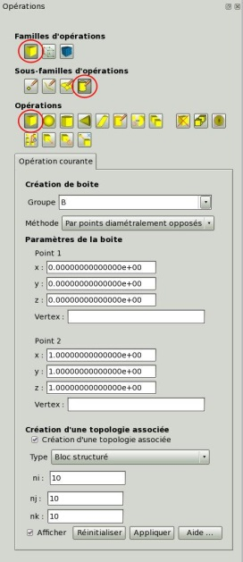

.. _operations:

Opérations
----------

.. only:: html
 
   .. raw:: html
 
      

         <main style="width:70%">

.. include:: operations-description.rst

:doc:`operations-geometriques`
   Opérations sur les entités géométriques de dimension 1, 2 ou 3

:doc:`operations-topologiques`
   Opérations sur les entités topologiques de dimension 1, 2 ou 3

:doc:`operations-maillage`
   Opérations sur les entités de maillage de dimension 1, 2 ou 3

:doc:`operations-reperes`
   Opérations sur les repères

.. only:: html

   .. raw:: html

         </main>
         <aside class="mysidebar">

.. only:: html

   .. raw:: html

         </aside>
      

.. toctree::
   :caption: Opérations
   :maxdepth: 2
   :hidden:

   operations-geometriques
   operations-topologiques
   operations-maillage
   operations-reperes

