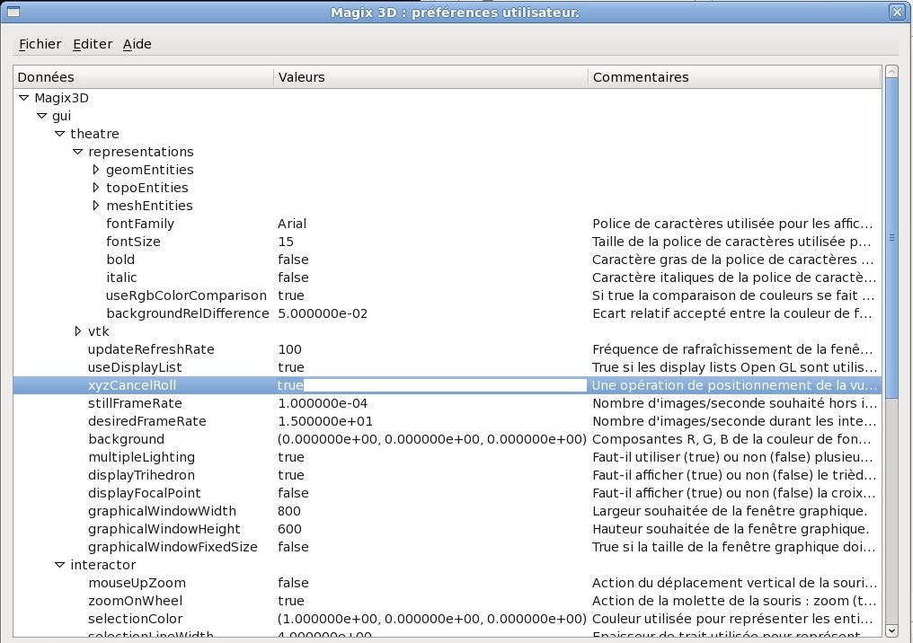

.. _preferences:

Préférences utilisateurs
************************

Les préférences utilisateur de Magix3D sont accessibles via le menu
*Projet.Préférences ...* L’activation de ce menu provoque l’affichage
d’une boite de dialogue d’édition des préférences utilisateur.

Les préférences sont regroupées en sections, composées de sous-sections
et ressources. Sections et ressources sont identifiées via un nom,
unique dans la section, et un éventuel commentaire. Les ressources ont
en plus une valeur pouvant être de différents types (chaine de
caractères, booléens, entiers, entiers non signés, réels, .couleurs).
Les valeurs possibles des booléens sont *true* et *false*. Les couleurs
sont définies par un triplet de composantes réelles RGB où chaque
composante doit être comprise entre 0 et 1 ((0., 0., 0.) pour le noir,
(1., 1., 1.) pour le blanc).

La modification d’une ressource s’effectue en double-cliquant sur le
champ contenant sa valeur, en modifiant la valeur et en validant la
saisie en pressant sur la touche retour-chariot.

Pour que les modifications prennent effet immédiatement il faut alors
activer le menu *Fichier.Appliquer* de l’éditeur. Pour qu’elles soient
prises en compte lors des prochaines sessions de Magix3D il faut activer
le menu *Fichier.Enregistrer*, ce qui a pour effet de les enregistrer
dans le fichier *~/.magix3d*.

Les ressources de Magix3D sont les suivantes :

Section **context** : ressources générales
==========================================

Section **threading** : ressources liées au multi-threading
--------------------------------------------------------------

-  **allowThreadedCommandTasks** : *true* si une commande est
   autorisée à être décomposée en plusieurs tâches exécutées
   parallèlement dans plusieurs threads, *false* si l'exécution
   doit être séquentielle.

-  **allowThreadedEdgePreMeshTasks** : true si le prémaillage des
   arêtes peut être décomposé en plusieurs tâches exécutées
   parallèlement dans plusieurs threads, false si l'exécution doit
   être séquentielle.

-  **allowThreadedFacePreMeshTasks** : true si le prémaillage des
   faces peut être décomposé en plusieurs tâches exécutées
   parallèlement dans plusieurs threads, false si l'exécution doit
   être séquentielle.

-  **allowThreadedBlockPreMeshTasks** : true si le prémaillage des
   blocs peut être décomposé en plusieurs tâches exécutées
   parallèlement dans plusieurs threads, false si l'exécution doit
   être séquentielle.

Section **scripting** : ressources liées au scripting
--------------------------------------------------------

-  **displayScriptOutputs** : *true* si le programme doit afficher
   les sorties des commandes script, *false* dans le cas
   contraire.

Section **optimizing** : ressources liées à l’optimisation
-------------------------------------------------------------

-  **memorizeEdgePreMesh** : *true* si le programme doit mémoriser
   le prémaillage des arêtes, *false* dans le cas contraire.

Section **gui** : ressources de l’IHM
=====================================

Section **theatre** : ressources liées à la fenêtre graphique 3D
----------------------------------------------------------------

-  Section **vtk** : ressources spécifiques à la couche graphique
   utilisée (VTK).

   .. _section-picking:
   
   -  Section **picking** : ressources liées au pointage à la
      souris

      -  **0DPickerTolerance** : tolérance appliquée lors de la
         sélection par pointage à la souris d'entités 0D par boite
         englobante, exprimée en pourcentage de la diagonale de la
         fenêtre graphique. Vaut *0.01* par défaut.

      -  **1DPickerTolerance** : tolérance appliquée lors de la
         sélection par pointage à la souris d'entités 1D par boite
         englobante. Vaut *0.001* par défaut.

      -  **2DPickerTolerance** : tolérance appliquée lors de la
         sélection par pointage à la souris d'entités 2D par boite
         englobante. Vaut *0.0001* par défaut.

      -  **3DPickerTolerance** : tolérance appliquée lors de la
         sélection par pointage à la souris d'entités 3D par boite
         englobante. Vaut *0.0001* par défaut.

      -  **cellPickerTolerance** : tolérance appliquée lors de la
         sélection par pointage à la souris d'entités par
         proximité directe (mode filaire). Vaut *0.05* par défaut

-  Section **representations** : ressources liées aux
   représentations des entités.

   -  Section **geomEntities** : ressources liées aux entités
      géométriques (CAO).

      -  **destroyOnHide** : *true* si le fait de ne plus afficher
         l’entité doit provoquer la destruction complète de sa
         représentation graphique, *false* dans le cas contraire
         (maintien en cache). Vaut *false* par défaut.

   -  Section **topoEntities** : ressources liées aux entités
      topologiques.

      -  **destroyOnHide** : idem même ressource de
         *geomEntities*.

      -  **displayFace** : Vrai si l'on souhaite voir les Faces en
         plus des CoFaces

      -  **displayEdge** : Vrai si l'on souhaite voir les Edges en
         plus des CoEdges

      -  **topoColorWithoutProj** : Composantes R, G, B de la
         couleur des entités topologiques sans associations.
         Valeurs comprises entre 0 et 1.

      -  **topoColorWith0DProj** : Composantes R, G, B de la
         couleur des entités topologiques avec une association de
         dimension 0. Valeurs comprises entre 0 et 1.

      -  **topoColorWith1DProj** : Composantes R, G, B de la
         couleur des entités topologiques avec une association de
         dimension 1. Valeurs comprises entre 0 et 1.

      -  **topoColorWith2DProj** : Composantes R, G, B de la
         couleur des entités topologiques avec une association de
         dimension 2. Valeurs comprises entre 0 et 1.

      -  **topoColorWith3DProj** : Composantes R, G, B de la
         couleur des entités topologiques avec une association de
         dimension 3. Valeurs comprises entre 0 et 1.

   -  Section **meshEntities** : ressources liées aux entités de
      maillage.

-  **destroyOnHide** : idem même ressource de *geomEntities*
   mais la valeur par défaut est *true*.

-  **updateRefreshRate** : Fréquence de rafraîchissement de la fenêtre
   graphique lors d'opérations ajouts/suppressions/modifications
   d'entités (1 rafraîchissement sur n opérations). Vaut *100* par
   défaut.

-  **useDisplayList** : *true* si les display lists Open GL sont
   utilisées, *false* dans le cas contraire. Vaut *true* par défaut.

-  **xyzCancelRoll** : une opération de positionnement de la vue dans
   un plan xOy, xOz, yOz (touches z, y ou x) doit-elle être suivie
   d'une annulation du roulis (*true*) ou non (*false*) ? Vaut *true*
   par défaut.

-  **stillFrameRate** : nombre d'images/seconde souhaité hors
   interactions. Vaut *1e-4* par défaut.

-  **desiredFrameRate** : nombre d'images/seconde durant les
   interactions. Vaut *15* par défaut.

-  **background** : composantes R, G, B de la couleur de fond de la
   fenêtre graphique. Valeurs comprises entre 0 et 1. Vaut *(0., 0.,
   0.)* par défaut (noir),

-  **multipleLighting** : Faut-il utiliser (true) ou non (false)
   plusieurs sources de lumière ?

-  **displayTrihedron** : faut-il afficher (*true*) ou non (*false*)
   le trièdre dans la fenêtre graphique. Vaut *false* par défaut.

-  **displayFocalPoint** : faut-il afficher (*true*) ou non (*false*)
   la croix matérialisant le point focal dans la fenêtre graphique.
   Vaut *false* par défaut.

-  **graphicalWindowWidth** : Largeur souhaitée de la fenêtre
   graphique.

-  **graphicalWindowHeight** : Hauteur souhaitée de la fenêtre
   graphique.

-  **graphicalWindowFixedSize** : True si la taille de la fenêtre
   graphique doit être fixe, false dans le cas contraire.

Section **interactor** : ressources liées aux interactions
----------------------------------------------------------

-  **mouseUpZoom** : action du déplacement vertical de la souris
   avec le bouton droit pressé. Si *false* le fait d'aller vers le
   bas provoque un zoom, alors que d'aller vers le haut diminue la
   vue. Action inversée si *true*. Vaut *false* par défaut.

-  **zoomOnWheel** : action de la molette de la souris. Zoom
   (*true*) ou déplacement vers le point focal (*false*). Vaut
   *false* par défaut. Le comportement est inversé en maintenant
   appuyé la touche CTRL.

-  **selectionColor** : couleur utilisée pour représenter les
   entités sélectionnées. Vaut *(1., 0., 0.)* par défaut (rouge).

-  **selectionLineWidth** : épaisseur de trait utilisée pour
   représenter les entités sélectionnées. Vaut *4* par défaut.

.. _nextSelectionKey:

-  **nextSelectionKey** : touche permettant de sélectionner à la
   souris l'entité suivante lorsque plusieurs entités se
   superposent à l'écran (*tab* pour tabulation, *space* pour
   espace). Un parcours en sens inverse est effectué si la touche
   *shift* (majuscule) est également pressée. Vaut *tab* par
   défaut.

-  **selectionOnTop** : *true* si le fait de sélectionner une
   entité provoque son affichage au premier plan, *false* si sa
   position dans la liste d'entités affichées est invariante. Vaut
   *false* par défaut.

-  **pickOnLeftButtonDown** : *true* si, en mode sélection, le
   fait de presser le bouton gauche de la souris doit déclencher
   une opération de pointage (picking), *false* dans le cas
   contraire. Vaut *false* par défaut.

-  **pickOnRightButtonDown** : *true* si, en mode sélection, le
   fait de presser le bouton droit de la souris doit déclencher
   une opération de pointage (picking), *false* dans le cas
   contraire. Vaut *false* par défaut.

-  **pickOnLeftButtonUp** : *true* si, en mode sélection, le fait
   de relâcher le bouton gauche de la souris doit déclencher une
   opération de pointage (picking), *false* dans le cas contraire.
   Vaut *true* par défaut.

-  **pickOnRightButtonUp** : *true* si, en mode sélection, le fait
   de relâcher le bouton droit de la souris doit déclencher une
   opération de pointage (picking), *false* dans le cas contraire.
   Vaut *false* par défaut.

-  **marginBoundingBoxPercentage** : pourcentage à appliquer aux
   échelles pour avoir les marges des boites englobantes, par
   exemple lors de la mise en évidence d'entités (highlighting).
   Une échelle est ici une puissance de 10 indiquant l'ordre de
   grandeur de taille d’un objet ou ensemble d'objets (ex : si
   xmin = 01. et xmax = 0.3, la taille est 0.2, l'échelle est 1,
   et la marge est égale à cette valeur multipliée par 1. Vaut
   *0.005* par défaut.

-  **highlightColor** : couleur des boites englobantes utilisées
   pour la mise en évidence d'entités (highlighting). Vaut *(1.,
   0.65, 0.)* par défaut (orange).

-  **highLightWidth** : épaisseur du trait des boites englobantes
   utilisées pour la mise en évidence d'entités (highlighting).
   Vaut *4* par défaut.

-  **highLightBoundinBox** : *true* si une boite englobante doit
   être représentée autour d'une entité mise en évidence
   (highlighting), *false* dans le cas contraire. Vaut *false* par
   défaut.

-  **useHighLightColor** : *true* si la couleur d'une entité doit
   être remplacée par la couleur de mise en évidence lors de la
   mise en évidence (highlighting), *false* dans le cas contraire.
   Vaut *true* par défaut.

-  **previewColor** : couleur utilisée pour afficher les éléments
   de prévisualisation (axes de rotation, boites englobantes,
   résultat d’une opération, ...). Vaut *(0.17, 0.65, 0.95)* par
   défaut (bleu vif).

-  **previewWidth** : épaisseur du trait utilisé pour afficher les
   éléments de prévisualisation (axes de rotation, boites
   englobantes, ...). Vaut *4* par défaut.

-  **previewPointSize** : épaisseur des points utilisée pour
   afficher les éléments de prévisualisation (extrémités de
   segments, ...). Vaut *10* par défaut.

Section **panels** : ressources des panneaux de l’IHM
-----------------------------------------------------

-  Section **operation** :

   -  **IDSeizureBackgroundColor** : composantes R, G, B de la
      couleur de fond des fenêtres de saisie des identifiants en
      mode de saisie interactive. Valeurs comprises entre 0 et 1.
      Vaut *(8.627451e-01, 7.843137e-01, 9.411765e-01)* par défaut
      (magenta).

   -  **prevalidateSeizure** : Faut-il procéder à une
      (pré-)validation des champs de texte de saisie des grandeurs
      numériques lorsque le panneau perd le focus ?

   -  **cancelClearEntities** : Les noms des entités des panneaux
      d'opérations doivent-ils être effacés lorsque les panneaux
      sont masqués ? Oui si true, non si false. Vaut *false* par
      défaut.

   -  **autoUpdateUsesSelection** : Les panneaux d'opérations 
      doivent-ils être initialisés (autant que possible) avec la 
      sélection en cours lors de leur affichage ? Oui si true, non
      si false. Vaut *true* par défaut.

   -  **showDialogOnCommandError** : Faut-il afficher une boite de 
      dialogue d'erreur lorsqu'une commande échoue ? Oui si true, non si
      false.
      
   -  **showAmodalDialogOnCommandError** : Faut-il afficher une boite de 
      dialogue d'erreur non modale lorsqu'une commande échoue ? Non si 
      true (risque de désorganiser le bureau courant, valeur par 
      défaut), oui si false (expérimental).
      
   - **commandNotificationDelay** : Durée d'exécution de commande en 
      secondes à partir de laquelle une notification système est
      envoyée.

-  Section **selection** :

   -  **maxIndividualProperties** : nombre maximum d'entités
      sélectionnées dont on détaille les propriétés
      individuelles. Vaut *50* par défaut.
      Attention : un nombre trop important peut abaisser
      significativement les performances du logiciel lors
      d’opérations de section.

   -  **maxCommonProperties** : nombre maximum d'entités
      sélectionnées dont on détaille les propriétés communes.
      Vaut *50* par défaut.
      Attention : un nombre trop important peut abaisser
      significativement les performances du logiciel lors
      d’opérations de section.

-  Section **groups** :

   -  **automaticSort** : True si les noms de groupes sont
      automatiquement triés, false dans le cas contraire.

   -  **sortType** : typeDescendingName pour un ordre alphabétique
      descendant, typeAscendingName pour un ordre alphabétique
      ascendant.

   -  **multiLevelGroupsView** : True si les groupes sont classés
      par niveau, false dans le cas contraire.

Section **logs** : ressources associées aux messages affichés dans l’onglet historique et concernant le déroulement de la session
---------------------------------------------------------------------------------------------------------------------------------

-  **informations** : *true* s’il faut afficher les messages
   d’information (lancement/terminaison des commandes, …), *false*
   dans le cas contraire. Vaut *true* par défaut.

-  **warnings** : *true* s’il faut afficher les messages
   d’avertissement, *false* dans le cas contraire. Vaut *true* par
   défaut.

-  **errors** : *true* s’il faut afficher les messages d’erreur,
   *false* dans le cas contraire. Vaut *true* par défaut.

-  **taskOutputs** : *true* s’il faut afficher les messages liés à
   l’exécution de commandes scriptées et aux processus lancés par
   Magix3D, *false* dans le cas contraire. Vaut *true* par défaut.

-  **traces_1** : *true* s’il faut afficher les messages d’aide à
   la mise au point relatifs aux commandes, *false* dans le cas
   contraire. Vaut *false* par défaut.

-  **traces_2** : *true* s’il faut afficher les messages d’aide à
   la mise au point relatifs aux commandes scriptées, *false* dans
   le cas contraire. Vaut *false* par défaut.

-  **traces_3** : *true* s’il faut afficher les messages d’aide à
   la mise au point relatifs aux commandes géométriques, *false*
   dans le cas contraire. Vaut *false* par défaut.

-  **traces_4** : *true* s’il faut afficher les messages d’aide à
   la mise au point relatifs aux commandes topologiques, *false*
   dans le cas contraire. Vaut *false* par défaut.

-  **traces_5** : *true* s’il faut afficher les messages d’aide à
   la mise au point relatifs aux commandes maillages, *false* dans
   le cas contraire. Vaut *false* par défaut.

-  **date** : *true* s’il faut faire apparaître la date dans les
   messages, *false* dans le cas contraire. Vaut *false* par
   défaut.

-  **time** : *true* s’il faut faire apparaître l’heure dans les
   messages, *false* dans le cas contraire. Vaut *false* par
   défaut.
   Remarque : utile, par exemple, pour évaluer les performances d’une
   commande.

-  **threadID** : *true* s’il faut faire apparaître l’identifiant du
   thread dans les messages, *false* dans le cas contraire. Vaut *false*
   par défaut.
   Remarque : utile lors de la mise au point de commandes de durée
   importante.

Section **scripting** : ressources liées à l’utilisation du scripting dans Magix3D (commandes ou fichiers en langage python)
----------------------------------------------------------------------------------------------------------------------------

-  **catchStdOutputs** : *true* si les flux standards (stdout/stderr)
   des commandes et fichiers scripts doivent être récupérées pour
   être traitées comme des logs, *false* dans le cas contraire. Vaut
   *true* par défaut.

   Attention : en mode production doit valoir *true*, la désactivation
   ne doit être utilisée que pour la mise au point du logiciel.

-  **recentScriptCapacity** : Taille paramétrable de la liste des
   scripts exécutés récemment.

Section **rays** : ressources liées à l’utilisation des rayons
--------------------------------------------------------------

-  **releaseIntermediateMemory** : Faut-il restituer la mémoire
   inutilisée dans les calculs des pointages lasers et diagnostics
   (calculs intermédiaires) ? Occupe moins de mémoire mais perte en
   temps de calcul.

-  **lineWidth** : Epaisseur du trait des faces des pointages laser

-  **raysOpacity** : Opacité ([0..1]) des faces des pointages laser,
   1 par défaut

-  **raysSpotOpacity** : Opacité ([0..1]) des taches des pointages
   laser, 1 par défaut

-  **spotTolerance** : Tolérance dans les calculs d'intersection
   pointage laser/maille, 1e-2 par défaut

-  **spotRepresentationCheat** : Faut-il essayer de limiter les
   moirés lors des représentations des taches ?

-  **spotRepresentationCheatFactor** : Pourcentage de proximité de la
   tâche à la surface de projection, 0.991 par défaut

-  **hiddenCellsElimination** : Faut-il supprimer les taches cachées
   ?

-  **offScreenWindowWidth** : Largeur de la fenêtre offscreen
   utilisée pour supprimer les taches cachées

-  **offScreenWindowHeight** : Hauteur de la fenêtre offscreen
   utilisée pour supprimer les taches cachées

-  **saveGuiState** : *true* si l'état de l'IHM (position, taille,
   organisation des panneaux...) doit être conservé d'une session à
   l'autre, *false* dans le cas contraire.

   Cet état est enregistré dans le fichier **~/.config /Magix3D.conf**.

-  **loadGuiState** : *true* si l'état de l'IHM (position, taille,
   organisation des panneaux...) enregistré en configuration doit être
   appliqué au lancement de Magix3D.

-  **confirmQuitAction** : *true* si une boite de dialogue de 
   confirmation doit tre affiche lorsque l'utilisateur met fin Magix3D, 
   *false* dans le cas contraire.

-  **margin** : marges (haut/bas/gauche/droite) à l'intérieur des
   panneaux. Elles valent 0 par défaut, l'objectif étant de gagner de la
   place. Les augmenter de 10 à 20 pixels si du texte est illisible.
   Nécessite de redémarrer l'application pour prendre effet.

-  **spacing** : espace séparant 2 composants (bouton, zone de texte...) à l'intérieur des panneaux. Ils valent 0 pixel par défaut,
   l'objectif étant de gagner de la place. Les augmenter de 10 à 20
   pixels si du texte est illisible. Nécessite de redémarrer
   l'application pour prendre effet.

