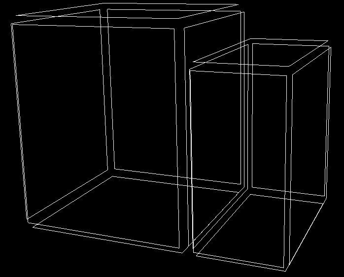
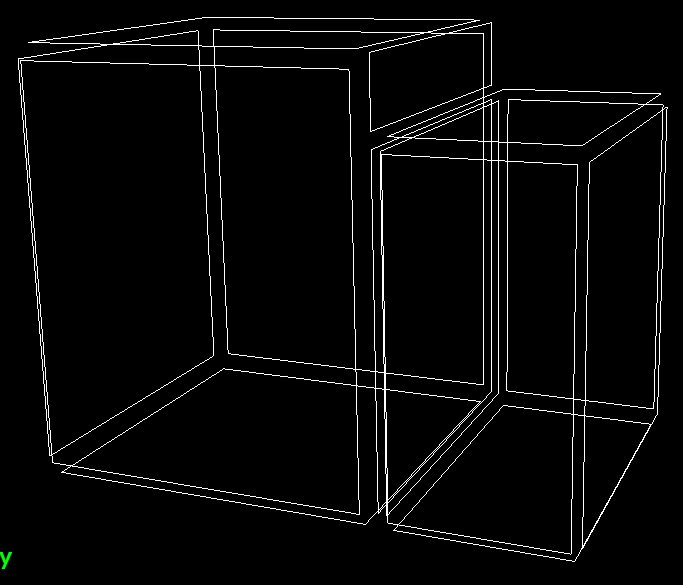
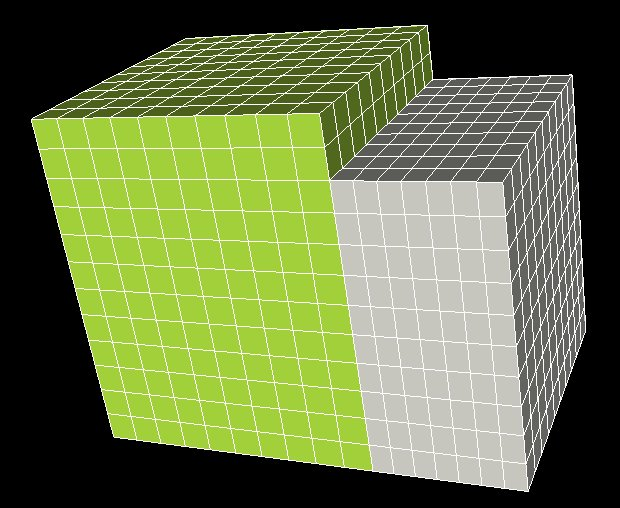

Maillage de 2 boites conformes avec recouvrement partiel
########################################################

Pré-requis
**********

Il faut avoir fait le :ref:`tutorial pour le cas de 2 boites conformes<tuto-2BoitesConformes>`.

Dans ce tutorial nous allons prendre en compte une semi-conformité topologique, c'est à dire un recouvrement partiel 
entre les 2 boites.

Si vous vous contentez de rejouer le collage comme cela a été fait pour le cas des 2 boites conformes, 
alors les volumes seront bien collés mais pas la topologie car il ne peut y avoir un collage entre les 2 faces sur 
le plan commun. 

Création des 2 boites
*********************

Utiliser pour cela les 2 lignes de commandes à copier dans le panneau *Commandes python* : 

.. code-block:: python

  ctx.getTopoManager().newBoxWithTopo (Mgx3D.Point(0, 0, 0), Mgx3D.Point(1, 1.2, 1), 10, 12, 10, "Mat1")
  ctx.getTopoManager().newBoxWithTopo (Mgx3D.Point(1, 0, 0), Mgx3D.Point(1.5, 1, 1), 7, 10, 10, "Mat2")

Les faces topologiques sont dans un même plan mais pas de la même taille, le collage n'est pas possible ainsi :

|deuxBoitesRPFaces1|

Découpage d'une face
********************

Il vous faut ouvrir le panneau *Discrétisation des arêtes* qui est accessible depuis le panneau *Opérations* en sélectionnant les boutons suivants :

.. taboperation:: 
      :famille: topologie
      :sousfamille: faces
      :operation: découpageface

Vous allez ensuite sélectionner les entités pour remplir les champs comme suit :

.. taboperationparams::
      :valeurs: Face, Fa0001
                Arête, Ar0005
                Entité, Som0010

Exécuter la commande avec le bouton *Appliquer*.

Le panneau *Commandes python* fait alors apparaître la commande équivalente : 

.. code-block:: python

  ctx.getTopoManager().splitFace ("Fa0001", "Ar0005", Mgx3D.Point(1, 1, 1), True)

La topologie des faces a maintenant cet aspect :

|deuxBoitesRPFaces2|

Opérations de collage, maillage et sauvegarde
*********************************************

Le collage se fait comme :ref:`pour le cas conforme<collage-2-boites>`. Il en est de même avec le :ref:`maillage<maillage-cas-conforme>` et 
la :ref:`sauvegarde<sauvegarde-cas-conforme>` de celui-ci. 

Le maillage
***********

Le maillage obtenu a cet aspect :

|deuxBoitesRPMaillage|

Le script final
***************

Il est alors possible de :ref:`sauvegarder<exporter-script>` l'ensemble des commandes utiles. Le fichier obtenu sera équivalent à ceci : 

.. code-block:: python

  #!/ccc/products/nec/bin/maillage_python
  # -*- coding: iso-8859-15 -*-
  import sys
  sys.path.append("/ccc/products/nec/share/packages")
  import maillage
  import pyMagix3D as Mgx3D
  ctx = Mgx3D.getStdContext()

  # Création d'une boite avec une topologie
  ctx.getTopoManager().newBoxWithTopo (Mgx3D.Point(0, 0, 0), Mgx3D.Point(1, 1.2, 1), 10, 12, 10, "Mat1")
  # Création d'une boite avec une topologie
  ctx.getTopoManager().newBoxWithTopo (Mgx3D.Point(1, 0, 0), Mgx3D.Point(1.5, 1, 1), 7, 10, 10, "Mat2")
  # Découpage de la face Fa0001
  ctx.getTopoManager().splitFace ("Fa0001", "Ar0005", Mgx3D.Point(1, 1, 1), True)
  # Collage entre géométries avec topologies
  ctx.getGeomManager().glue(["Vol0000", "Vol0001"])
  # Création du maillage pour tous les blocs
  ctx.getMeshManager().newAllBlocksMesh()
  # Sauvegarde du maillage (mli)
  ctx.getMeshManager().writeMli("deuxBoitesRP.mli")

