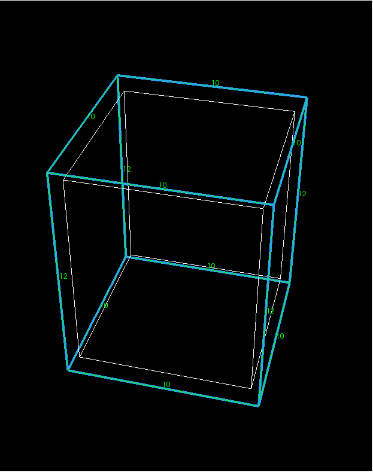

.. _tuto-2BoitesConformes:

Maillage de 2 boites conformes
###############################

Pré-requis
**********

:ref:`Lancer l'IHM<lancement>` de Magix3D. Si nécessaire, :ref:`modifier son aspect<modification-aspect>`. 

Construction de la 1ère boite
*****************************
Ouvrir le panneau *Création de boite* qui est accessible depuis le panneau :ref:`operations` 
en sélectionnant les boutons suivants :

.. taboperation:: 
      :famille: géométrie
      :sousfamille: volumes
      :operation: boite

|selectionCreationBoite|

Pour notre exemple, nous vous proposons de créer une boite en spécifiant les coordonnées de 2 coins diamétralement opposés.

On choisira d'associer cette boite au groupe *Mat1*.

La création de boite permet de créer une topologie associée. Par défaut, il s'agit d'un bloc structuré. Ce bloc porte les informations de discrétisation.
On voit dans la partie topologie que par défaut la discrétisation est à 10 bras pour chaque arête du bloc dans chaque dimension. 

On propose de modifier la discrétisation en y à 12 bras. 
Pour cela, il faut modifier les champs suivants :

.. taboperationparams::
      :valeurs: Groupe, Mat1
                Point 2 / y, 1.2
                nj, 12

Pour valider la commande et l'exécuter, cliquer ensuite sur le bouton *Appliquer*.

Le panneau *Commandes python* fait alors apparaître la commande équivalente : 

.. code-block:: python

  # Création d'une boite avec une topologie
  ctx.getTopoManager().newBoxWithTopo (Mgx3D.Point(0, 0, 0), Mgx3D.Point(1, 1.2, 1), 10, 12, 10, "Mat1")

Certaines des entités créées sont alors affichées suivant les filtres d'affichage (voir :ref:`filtre-dimension-entites`).

En cochant *Topologie/Blocs* dans la fenêtre **Gestionnaire d'entités**, on visualise le bloc créé en plus de la boite.
Après avoir coché *Topologie/Arêtes*, on peut configurer l'affichage pour les arêtes (clic droit / *Représentations ...*) et choisir d'afficher le nombre de bras de la discrétisation. 
On obtient alors la vue suivante :

Construction de la 2ème boite
*****************************

Deux possibilités pour arriver au même résultat.
Vous pouvez essayer la première puis annuler la commande avant d'essayer la deuxième. 

En utilisant le panneau *Création de boite*
===========================================

On précède de la même façon que pour la première boite, en positionnant les valeurs suivantes :

.. taboperationparams::
      :valeurs: Groupe, Mat2
                Point 1 / x, 1
                Point 2 / x, 1.5
                Point 2 / y, 1.2
                nj, 12

Cliquer ensuite sur le bouton Appliquer.

On obtient alors la vue suivante :

Le panneau *Commandes python* fait apparaître la commande équivalente : 

.. code-block:: python

  # Création d'une boite avec une topologie
  ctx.getTopoManager().newBoxWithTopo (Mgx3D.Point(1, 0, 0), Mgx3D.Point(1.5, 1.2, 1), 10, 12, 10, "Mat2")

Pour tester la seconde méthode de construction, il possible d'annuler la commande qui vient d'être exécutée par la commande :ref:`annuler`.

En utilisant le panneau *Commandes python*
==========================================

Aller dans le panneau *Commandes python* et cliquer sur la dernière ligne vierge

Il suffit ensuite de copier la commande précédemment exécutée et de la modifier pour renseigner les bons paramètres, puis exécuter la commande en appuyant sur le bouton |run|.

.. _collage-2-boites:

Collage des 2 boites
********************

Il vous faut ouvrir le panneau *Opérations booléennes sur des volumes* qui est accessible depuis le panneau *Opérations* 
en sélectionnant les boutons suivants :

.. taboperation:: 
      :famille: géométrie
      :sousfamille: volumes
      :operation: operationsbooléennes

Ensuite, sélectionner comme type d'opération le *Collage*. 
Positionner le curseur sur le champ *Volumes* et sélectionner les deux volumes présents à l'aide de la souris en maintenant la touche *Ctrl* enfoncée.

Plus d'information sur les méthodes de sélection :ref:`ici<boutons-selection>`. 
Terminer par *Appliquer*.

Le panneau *Commandes python* fait alors apparaître la commande équivalente:

.. code-block:: python

  # Collage entre géométries avec topologies
  ctx.getGeomManager().glue(["Vol0000", "Vol0001"])

Les 2 volumes et les 2 topologies ont été collés. C'est à dire qu'à la frontière il n'y a plus qu'une surface partagée 
et une coface partagée. Il en est de même pour les entités de dimensions inférieures (sommets géométriques et topologiques, 
courbes et arêtes), une seule des deux entités superposées a été conservée. 

.. warning::

  Le collage est possible car la discrétisation des 2 arêtes à fusionner est identique. Sinon, on aurait obtenu un message d'erreur :
  
  .. code-block:: python

    # Remplace l'arête Ar0013 par Ar0005 problématique car les discrétisations sont différentes (10 < 12)

Modification d'une discrétisation
*********************************

Par défaut la discrétisation est uniforme. Pour changer les paramètres de discrétisation, ouvrir le panneau *Discrétisation des arêtes* qui est accessible depuis le panneau *Opérations* 
en sélectionnant les boutons suivants :

.. taboperation:: 
      :famille: topologie
      :sousfamille: arêtes
      :operation: discrétisation

On peut, par exemple, modifier les champs comme suit :

.. taboperationparams::
      :valeurs: Méthode, Discrétisation d'arêtes parallèles
                Nombre de bras, 13
                Algorithme, Progression géométrique
                Raison, 1.2
                Arêtes, Ar0022

L'arête est à sélectionner avec la souris ou il est possible de taper son nom directement dans le champ *Arêtes*.

Exécuter la commande avec le bouton *Appliquer*.

Le panneau *Commandes python* fait alors apparaître la commande équivalente : 

.. code-block:: python

  # Changement de discrétisation pour Ar0022
  emp = Mgx3D.EdgeMeshingPropertyGeometric(13,1.2)
  ctx.getTopoManager().setParallelMeshingProperty (emp,"Ar0022")

.. _maillage-cas-conforme:

Création du maillage et sauvegarde
**********************************

Pour créer le maillage, cliquer sur le bouton |toutMailler| dans la barre d'outils. Plus d'information sur cette commande et celles associées :ref:`ici<menu-maillage>`.

.. |toutMailler| image:: ../images/image27.png 
  :scale: 60%

Le maillage obtenu a cet aspect (à condition que la visibilité des volumes de mailles soit activée : *Maillage/Volumes* coché dans le *Gestionnaire d'entités*).

|deuxBoitesMaillage|

Pour sauvegarder le maillage obtenu, cliquer sur le bouton |exporterTout| dans la barre d'outils et renseigner le nom du fichier et son format (*deuxBoites.mli2*).
Plus d'information sur cette commande :ref:`ici<exporter>`.

.. |exporterTout| image:: ../images/image9.png 
  :scale: 50%

Le panneau *Commandes python* fait alors apparaître les commandes suivantes :

.. code-block:: python

  # Création du maillage pour tous les blocs
  ctx.getMeshManager().newAllBlocksMesh()
  # Sauvegarde du maillage (mli)
  ctx.getMeshManager().writeMli("deuxBoites.mli2")

.. _sauvegarde-cas-conforme:

Sauvegarde du script
********************

Il est alors possible de :ref:`sauvegarder<exporter-script>` l'ensemble des commandes utiles (*Ctrl+S*).
Le fichier obtenu sera équivalent à ceci :

.. code-block:: python

  # -*- coding: utf-8 -*-
  import sys
  import pyMagix3D as Mgx3D
  ctx = Mgx3D.getStdContext()

  # Création d'une boite avec une topologie
  ctx.getTopoManager().newBoxWithTopo (Mgx3D.Point(0, 0, 0), Mgx3D.Point(1, 1.2, 1), 10, 12, 10, "Mat1")
  # Création d'une boite avec une topologie
  ctx.getTopoManager().newBoxWithTopo (Mgx3D.Point(1, 0, 0), Mgx3D.Point(1.5, 1.2, 1), 10, 12, 10, "Mat2")
  # Collage entre géométries avec topologies
  ctx.getGeomManager().glue(["Vol0000", "Vol0001"])
  # Changement de discrétisation pour Ar0022
  ctx.getTopoManager().setParallelMeshingProperty (Mgx3D.EdgeMeshingPropertyGeometric(13,1.2),"Ar0022")
  # Création du maillage pour tous les blocs
  ctx.getMeshManager().newAllBlocksMesh()
  # Sauvegarde du maillage (mli)
  ctx.getMeshManager().writeMli("deuxBoites.mli2")

.. include:: substitution-images.rst
