.. _tuto-2CylindresCreux:

Maillage de 2 cylindres creux
#############################

.. warning::
  Le comportement de Magix3D ayant changé avec certaines versions, ce tutoriel est adapté aux 
  versions **1.6.3** et **1.7.0**. Il ne fonctionne pas avec les versions 1.6.4 et 1.6.5. 
  Les changements qui ont affecté ce tutoriel sont liés à l'ordre des entités issus d'une 
  opération booléenne sur la géométrie.

Préambule
*********

L'objectif est de faire un maillage structuré par bloc avec uniquement des hexaèdres réguliers 
(donc sans prismes) de deux cylindres creux qui s'intersectent. 
Nous maillerons le vide à l'intérieur de chacun des deux cylindres.

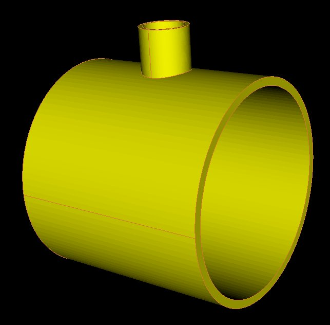

Du fait qu'il y a un grand nombre d'opérations pour réaliser le maillage, nous détaillerons les opérations dans leur version Python et minimiserons les détails pour l'utilisation de l'IHM. 

Pré-requis
**********

Il est nécessaire d'avoir compris le fonctionnement des :ref:`précédents tutoriels<index-tutoriels>` et de comprendre l'intérêt de la décomposition par blocs en o-grid.

Construction de la géométrie
****************************

Bien qu'il soit possible de créer directement un cylindre creux, nous allons créer les différents 
cylindres pleins et faire les opérations de fusion et collage à la suite.
Nous vous recommandons d'activer dans le :ref:`filtre de représentation <gestion-entites>` uniquement la vue 
des volumes géométriques.

Construction du 1 :sup:`er` cylindre (plein) avec une topologie
===============================================================

Il faut pour cela ouvrir le panneau *Création de cylindre* qui est accessible depuis le 
panneau *Opérations* en sélectionnant les boutons suivants :

.. taboperation:: 
      :famille: géométrie
      :sousfamille: volumes
      :operation: cylindre

Modifier les champs suivants et *Appliquer* :

.. taboperationparams::
      :valeurs: Groupe, OR
                Rayon externe, 5.4

La commande Python :

.. code-block:: python

  ctx.getTopoManager().newCylinderWithTopo (Mgx3D.Point(0, 0, 0), 5.4, Mgx3D.Vector(10, 0, 0), 360, True, .5, 10, 10, 10, "OR")

Construction du cylindre pour le vide associé au 1 :sup:`er` cylindre
=====================================================================

Nous utilisons le même panneau. Modifier les champs suivants et *Appliquer* :

.. taboperationparams::
      :valeurs: Groupe, VIDE
                Rayon externe, 5.0
                Création d'une topologie associée, Décoché

La commande Python :

.. code-block:: python

  ctx.getGeomManager().newCylinder (Mgx3D.Point(0, 0, 0), 5, Mgx3D.Vector(10, 0, 0), 360, "VIDE")

Construction du 2 :sup:`ème` cylindre externe
=============================================

Nous utilisons le même panneau. Modifier les champs suivants et *Appliquer* :

.. taboperationparams::
      :valeurs: Groupe, OR
                Centre de la base / x, 5
                Centre de la base / y, 4.5
                Rayon externe, 1.2
                Vecteur directeur / dx, 0
                Vecteur directeur / dy, 3

La commande Python :

.. code-block:: python

  ctx.getGeomManager().newCylinder (Mgx3D.Point(5, 4.5, 0), 1.2, Mgx3D.Vector(0, 3, 0), 360, "OR")

La géométrie comporte alors 3 volumes:

.. image:: ../images/CylindreOreille_3vol.jpeg
    :width: 350px

Découpage du 2 :sup:`ème` cylindre externe
==========================================

Il vous faut ouvrir le panneau *Opérations booléennes sur des volumes* qui est accessible 
depuis le panneau *Opérations* en sélectionnant les boutons suivants :

.. taboperation:: 
      :famille: géométrie
      :sousfamille: volumes
      :operation: union

.. line-block::
  Ensuite, sélectionner *Section* comme type d'opération.
  Sélectionner comme volume à couper celui du 2 :sup:`ème` cylindre externe (*Vol0002*) à l'aide du :ref:`champ de sélection <selectionner-entites>`.
  Sélectionner comme surface pour couper celle qui est circulaire et dans le volume de vide (interne au premier cylindre, *Surf0003*).

La commande Python :

.. code-block:: python

  ctx.getGeomManager().section(["Vol0002"], "Surf0003")

La géométrie comporte alors 4 volumes :

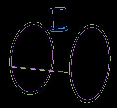

Destruction du volume interne au vide issu du 2 :sup:`ème` cylindre externe
===========================================================================

Il faut pour cela ouvrir le panneau *Destruction d'entités géométriques* qui est accessible depuis le panneau *Opérations* en sélectionnant les boutons suivants :

.. taboperation:: 
      :famille: géométrie
      :sousfamille: volumes
      :operation: destructiongeom

Sélectionner comme volume à détruire celui à l'intérieur du vide et issu de la section du 2 :sup:`ème` cylindre externe (*Vol0004*) à l'aide du :ref:`champ de sélection <selectionner-entites>`.

La commande Python :

.. code-block:: python

  ctx.getGeomManager().destroy(["Vol0004"], True)

Construction du cylindre pour le vide du 2 :sup:`ème` cylindre
==============================================================

Il faut pour cela réouvrir le panneau *Création de cylindre* vu précédemment.

Modifier les champs suivants et *Appliquer* :

.. taboperationparams::
      :valeurs: Groupe, VIDE
                Rayon externe , 1
                Création d'une topologie associée, Décoché

La commande Python :

.. code-block:: python

  ctx.getGeomManager().newCylinder (Mgx3D.Point(5, 4.5, 0), 1, Mgx3D.Vector(0, 3, 0), 360, "VIDE")

Découpage du cylindre pour le vide du 2 :sup:`ème` cylindre
===========================================================

Il faut pour cela ré-ouvrir le panneau *Opérations booléennes sur des volumes* vu précédemment.

Sélectionner comme volume à couper celui du 2 :sup:`ème` cylindre interne (*Vol0005*) à l'aide du champ de sélection
Sélectionner comme surface pour couper celle qui est au bord du volume externe de ce 2 :sup:`ème` cylindre (*Surf0011*).

La commande Python :

.. code-block:: python

  ctx.getGeomManager().section(["Vol0005"], "Surf0009")

Destruction du volume interne au vide issu du 2 :sup:`ème` cylindre externe
===========================================================================

Il faut pour cela ré-ouvrir le panneau *Destruction d'entités géométriques*.

Sélectionner comme volume à détruire celui à l'intérieur du vide et issu de la section du dernier cylindre (interne, *Vol0007*) à l'aide du champ de sélection.

La commande Python :

.. code-block:: python

  ctx.getGeomManager().destroy(["Vol0007"], True)

La géométrie comporte alors 4 volumes dont 2 ont été coupés :

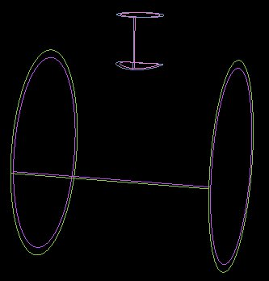

Fusion des volumes en OR
========================

Il vous faut ré-ouvrir le panneau *Opérations booléennes sur des volumes*.
Ensuite, sélectionner *Union* comme type d'opération.
Sélectionner les 2 volumes externes des 2 cylindres (*Vol0000* et *Vol0003*), et *Appliquer*.

La commande Python :

.. code-block:: python

  ctx.getGeomManager().fuse(["Vol0000", "Vol0003"])

Collage des différents volumes
==============================

Toujours avec le panneau *Opérations booléennes sur des volumes*.

Ensuite, sélectionner *Collage* comme type d'opération. Sélectionner les 3 volumes existants (*Vol0001*, *Vol0006* et *Vol0008*), et *Appliquer*.

.. note::

  Pour sélectionner tous les volumes, il est possible de passer par le menu contextuel lorsque le curseur est sur le champ *Volumes* dans la rubrique *Géométrie* du *Gestionnaire d'entités*,
  activer alors *Sélectionner les entités visibles*.

.. warning::
  
  Le résultat de cette commande est sensible à l'ordre des entités en entrée.

La commande Python :

.. code-block:: python

  ctx.getGeomManager().glue(["Vol0001", "Vol0006", "Vol0008"])

Rectification des groupes
=========================

Les différentes opérations de collage ne permettent pas de conserver l'association entre les groupes et les volumes. Aussi est-il nécessaire de reconstruire les groupes.

Il faut pour cela ouvrir le panneau *Ajout/suppression/affectation d'entités géométriques à un groupe* qui est accessible depuis le panneau *Opérations* en sélectionnant les boutons suivants :

.. taboperation:: 
      :famille: géométrie
      :sousfamille: volumes
      :operation: geomtogroupe

Modifier les champs suivants et *Appliquer* :

.. taboperationparams::
      :valeurs: Groupe, OR
                Opération , Affecter
                Entités géométriques, Vol0010

Recommencer avec les champs suivants et *Appliquer* :

.. taboperationparams::
      :valeurs: Groupe, VIDE
                Opération , Affecter
                Entités géométriques, Vol0009 Vol0006

Les commandes Python :

.. code-block:: python

  ctx.getGeomManager().setGroup (["Vol0010"], 3, "OR")
  ctx.getGeomManager().setGroup (["Vol0009", "Vol0006"], 3, "VIDE")

La géométrie comporte désormais 3 volumes:

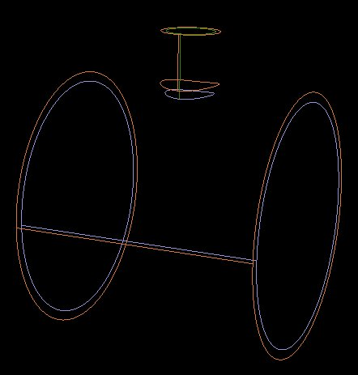

Construction de la topologie
****************************

Nous disposons déjà d'un début de topologie pour le 1 :sup:`er` cylindre.
Nous allons commencer par créer un bloc pour le 2 :sup:`ème` cylindre.

Nous vous recommandons d'activer dans le :ref:`filtre de représentation <gestion-entites>` uniquement la vue des volumes géométriques et des arêtes topologiques.

Construction d'un bloc pour le 2 :sup:`ème` cylindre
====================================================

Nous allons associer un nouveau bloc au volume du 2 :sup:`ème` cylindre. Pour cela ouvrir le panneau *Création de bloc par association à un volume*
 qui est accessible depuis le panneau *Opérations* en sélectionnant les boutons suivants :

.. taboperation:: 
      :famille: topologie
      :sousfamille: blocs
      :operation: bloc

Vous allez ensuite sélectionner l'entité pour remplir les champs comme suit, puis *Appliquer* :

.. taboperationparams::
      :valeurs: Volume, Vol0006
                Type , Bloc structuré libre

La commande Python :

.. code-block:: python

  ctx.getTopoManager().newFreeTopoOnGeometry ("Vol0006")

Découpage des blocs dans le 1 :sup:`er` cylindre
================================================

Le découpage des blocs périphériques de l'o-grid dans ce cylindre permet de séparer en deux parties distinctes l'or du vide. 
La topologie de l'or correspondra aux blocs les plus à l'extérieur et celle du vide sera constituée des 5 blocs en o-grid au centre.

Pour cela ouvrir le panneau *Découpage de blocs selon une arête* qui est accessible depuis le panneau *Opérations* en sélectionnant les boutons suivants :

Vous allez ensuite sélectionner les 4 blocs en périphérie de l'o-grid dans le 1 :sup:`er` cylindre ainsi qu'une arête transversale (qui va de l'extérieur de l'o-grid vers le centre). 
Les entités sélectionnées sont en orange :

.. image:: ../images/CylindreOreille_splitBlocks1.jpeg
  :width: 350px

Lorsque les champs du panneau seront remplis comme suit, exécuter la commande avec le bouton *Appliquer* :

.. taboperationparams::
      :valeurs: Blocs, Bl0000 Bl0001 Bl0002 Bl0003
                Arête , Ar0017
                Ratio, 0.8

.. warning::
  
  Le résultat de cette commande est sensible à l'ordre des entités en entrée.

La commande Python :

.. code-block:: python

  ctx.getTopoManager().splitBlocks (["Bl0001", "Bl0002", "Bl0003", "Bl0000"], "Ar0017",.8)

Associations avec la géométrie pour le 1 :sup:`er` cylindre
===========================================================

Nous allons enchainer une série d'associations, et pour ce faire nous allons utiliser différents panneaux.

Sachant que les entités topologiques ont des couleurs qui dépendent du type d'association vers la géométrie, nous allons mettre à jour les associations. 
Il est possible de contrôler les associations en affichant celles-ci à l'aide des paramètres de représentation des entités.

Association entre sommets et courbes internes du 1 :sup:`er` cylindre
---------------------------------------------------------------------

Ouvrir le panneau *Associations entités topologiques 0D, 1D, 2D -> entité(s) géométrique(s)* qui est accessible depuis le panneau *Opérations* en sélectionnant les boutons suivants :

.. taboperation:: 
      :famille: topologie
      :sousfamille: sommets
      :operation: modificationassociation

Vous allez ensuite sélectionner la méthode de projection au plus près pour des sommets vers des entités 1D (courbes). 
Sélectionner les sommets à proximités des courbes internes ainsi que les 2 courbes. Les courbes à sélectionner sont en orange :

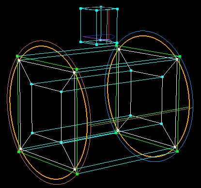

Lorsque les champs du panneau seront remplis comme suit, exécuter la commande avec le bouton *Appliquer* :

.. taboperationparams::
      :valeurs: Blocs, Sommets -> E. géométriques
                Vertices , Som0048 Som0049 Som0050 Som0051 Som0052 Som0053 Som0054 Som0055
                D1, Coché
                Entités géométriques, Crb0003 Crb0005

La commande Python :

.. code-block:: python

  ctx.getTopoManager().projectVerticesOnNearestGeomEntities (["Som0048", "Som0051", "Som0052", "Som0055", "Som0054", "Som0053", "Som0050", "Som0049"], ["Crb0003", "Crb0005"], True)

Association automatique entre arêtes et courbes internes du 1 :sup:`er` cylindre
--------------------------------------------------------------------------------

Avec le même panneau, sélectionner la méthode de projection pour les arêtes, puis sélectionner les arêtes à projeter sur les 2 courbes internes.

Lorsque les champs du panneau seront remplis comme suit, exécuter la commande avec le bouton *Appliquer* :

.. taboperationparams::
      :valeurs: Méthode, Arêtes -> Courbes
                Arêtes , Ar0082 Ar0083 Ar0089 Ar0090 Ar0096 Ar0097 Ar0098 Ar0099

La commande Python :

.. code-block:: python

  ctx.getTopoManager().projectEdgesOnCurves (["Ar0083", "Ar0099", "Ar0097", "Ar0090", "Ar0082", "Ar0098", "Ar0096", "Ar0089"])

Associations vers la surface en x :sub:`min` du 1 :sup:`er` cylindre
--------------------------------------------------------------------

Avec le même panneau, sélectionner la méthode de projection pour les entités topologiques vers une entité géométrique, puis sélectionner dans un premier temps les sommets en x :sub:`min` au centre de l'o-grid, dans un second les arêtes, ainsi que la surface en x :sub:`min`. Pour faciliter la sélection des sommets il est conseillé de n'activer que D0 dans un premier temps, puis D1 pour sélectionner les arêtes.

Lorsque les champs du panneau seront remplis comme suit, exécuter la commande avec le bouton *Appliquer* :

.. taboperationparams::
      :valeurs: Méthode, E. Topologiques -> E. géométrique
                D0 puis D1 (topologique) , Cochés
                Entité Topologiques, Som0018 Som0008 Som0026 Som0027 Ar0077 Ar0075 Ar0012 Ar0005 Ar0037 Ar0028 Ar0086 Ar0092
                D2 (géométrique), Coché
                Entité géométrique, Surf0005

La commande Python :

.. code-block:: python

  ctx.getTopoManager().setGeomAssociation (["Som0018", "Som0008", "Som0026", "Som0027", "Ar0077", "Ar0075", "Ar0012", "Ar0005", "Ar0037", "Ar0028", "Ar0086", "Ar0092"], "Surf0005", True)

Associations vers la surface en x :sub:`max` du 1 :sup:`er` cylindre
--------------------------------------------------------------------

Comme pour la commande précédente, du côté x :sub:`max`.

La commande Python :

.. code-block:: python

  ctx.getTopoManager().setGeomAssociation (["Som0022", "Som0012", "Som0030", "Som0031", "Ar0073", "Ar0014", "Ar0039", "Ar0007", "Ar0030", "Ar0084", "Ar0079", "Ar0094"], "Surf0004", True)

Associations des blocs du 1 :sup:`er` cylindre
----------------------------------------------

Ouvrir le panneau *Associations blocs topologiques -> volume géométrique* qui est accessible depuis le panneau *Opérations* en sélectionnant les boutons suivants :

.. taboperation:: 
      :famille: topologie
      :sousfamille: blocs
      :operation: modificationassociation

Sélectionner les blocs internes qui correspondent au vide ainsi que le volume de vide du 1 :sup:`er` cylindre. Lorsque les champs du panneau seront remplis comme suit, exécuter la commande avec le bouton *Appliquer* :

.. taboperationparams::
      :valeurs: Blocs, Bl0004 Bl0006 Bl0008 Bl0011 Bl0013
                Volume, Vol0009

La commande Python :

.. code-block:: python

  ctx.getTopoManager().setGeomAssociation (["Bl0008", "Bl0006", "Bl0004", "Bl0013", "Bl0011"], "Vol0009", False)

Association automatique entre arêtes et surface interne du 1 :sup:`er` cylindre
-------------------------------------------------------------------------------

Ouvrir le panneau *Associations blocs topologiques -> volume géométrique* qui est accessible depuis le panneau *Opérations* en sélectionnant les boutons suivants :

.. taboperation:: 
      :famille: topologie
      :sousfamille: arêtes
      :operation: modificationassociation

Sélectionner la méthode de projection pour les arêtes, puis sélectionner les arêtes à projeter sur la surface internes et de direction l'axe des X.

Lorsque les champs du panneau seront remplis comme suit, exécuter la commande avec le bouton *Appliquer* :

.. taboperationparams::
      :valeurs: Méthode, Arêtes -> Courbes
                Arêtes, Ar0076 Ar0095 Ar0088 Ar0081

La commande Python :

.. code-block:: python

  ctx.getTopoManager().projectEdgesOnCurves (["Ar0076", "Ar0095", "Ar0088", "Ar0081"])

Association automatique entre faces et surfaces pour le 1 :sup:`er` cylindre
----------------------------------------------------------------------------

Avec ce même panneau, sélectionner la méthode de projection des faces. Sélectionner toutes les faces du vide et *Appliquer*.

Pour sélectionner toutes les faces du vide, aller dans le menu contextuel au niveau du champ *VIDE* du gestionnaire d'entités et aller dans *Sélectionner.../Faces topologiques*.

La commande Python :

.. code-block:: python

  ctx.getTopoManager().projectFacesOnSurfaces (["Fa0001", "Fa0008", "Fa0012", "Fa0021", "Fa0028", "Fa0029", "Fa0040", "Fa0042", "Fa0037", "Fa0044", "Fa0045", "Fa0047", "Fa0049", "Fa0051", "Fa0053", "Fa0055", "Fa0057", "Fa0058", "Fa0038", "Fa0060", "Fa0062", "Fa0063"])

Cette sélection peut aussi se faire en Python, pour cela utiliser :

.. code-block:: python

  ctx.getGroupManager().getTopoFaces(["VIDE"])

La commande précédente peut alors s'écrire :

.. code-block:: python

  ctx.getTopoManager().projectFacesOnSurfaces (ctx.getGroupManager().getTopoFaces(["VIDE"]))

Découpages de blocs du 1 :sup:`er` cylindre pour raccordement avec le 2 :sup:`ème`
==================================================================================

Découpage d'un bloc dans l'or et d'un bloc dans le vide, en 5 étapes illustrées ici :

.. rst-class:: image-with-caption

    ==============================    ==============================    ==============================  ==============================    ==============================
    |cylindreOreilleSplitBlocks20|    |cylindreOreilleSplitBlocks21|    |cylindreOreilleSplitBlocks22|  |cylindreOreilleSplitBlocks23|    |cylindreOreilleSplitBlocks24|
    Avant de couper                   Après 1 :sup:`ère` coupe          Après 2 :sup:`ème` coupe        Après 3 :sup:`ème` coupe          Après 4 :sup:`ème` coupe
    ==============================    ==============================    ==============================  ==============================    ==============================

On termine par la suppression du bloc central (par rapport à nos coupes) dans l'or pour y mettre, par la suite, un bloc en provenance de l'autre cylindre.

.. warning::

  Le résultat de ces commandes est sensible à l'ordre des entités en entrée.

Les commandes Python :

.. code-block:: python
  
  ctx.getTopoManager().splitBlocks (["Bl0007", "Bl0006"], "Ar0023",.4)
  ctx.getTopoManager().splitBlocks (["Bl0014", "Bl0016"], "Ar0101",.4)
  ctx.getTopoManager().splitBlocks (["Bl0019", "Bl0021"], "Ar0111",.4)
  ctx.getTopoManager().splitBlocks (["Bl0022", "Bl0024"], "Ar0140",.7)
  ctx.getTopoManager().destroy (["Bl0027"], True)

Découpage en o-grid du bloc du 2 :sup:`ème` cylindre
====================================================

Un premier découpage pour séparer les blocs entre l'or et le vide. Pour cela ouvrir le panneau *Découpage de bloc avec o-grid* qui est accessible depuis le panneau *Opérations* en sélectionnant les boutons suivants :

.. taboperation:: 
      :famille: topologie
      :sousfamille: blocs
      :operation: découpageblocogrid

Vous allez ensuite sélectionner les entités pour remplir les champs comme suit, puis *Appliquer* :

.. taboperationparams::
      :valeurs: Blocs, Bl0005
                Faces, Fa0032 Fa0033
                Ratio, 0.8
                Nombre de bras, 2

La commande Python :

.. code-block:: python

  ctx.getTopoManager().splitBlocksWithOgrid (["Bl0005"], ["Fa0032", "Fa0033"], .8, 2)

Associations avec la géométrie pour le 2 :sup:`ème` cylindre
============================================================

Comme vu précédemment, il s'agit ici de faire les associations entre sommets et arêtes vers une courbe.

Pour savoir à laquelle des courbes il est fait référence dans les commandes Python ci-dessous, nous vous proposons d'utiliser la commande de recherche d'une entité. 
Faites *CTRL+F*, une fenêtre va apparaitre dans laquelle vous allez renseigner le champ identifiant par le nom de la courbe (pour la première courbe : *Crb0012*). 
Activez la représentation des courbes comme type d'entités (à la place des volumes). La courbe sélectionnée apparait surlignée en rouge.

Les 2 premières commandes font la projection sur les courbes en Y :sub:`max` du 2 :sup:`ème` cylindre.
Les 2 suivantes font la projection sur les demis courbes en Y  :sub:`min` pour les 2 groupes topologiques. Ceci à fin de mettre en vis à vis les faces à fusionner par la suite.

Les commandes Python :

.. code-block:: python

  ctx.getTopoManager().setGeomAssociation (["Som0087", "Som0083", "Som0082", "Som0086", "Ar0191", "Ar0195", "Ar0187", "Ar0194"], "Crb0012", True)
  ctx.getTopoManager().setGeomAssociation (["Som0047", "Som0043", "Som0042", "Som0046", "Ar0071", "Ar0063", "Ar0070", "Ar0061"], "Crb0006", True)
  ctx.getTopoManager().setGeomAssociation (["Som0070", "Som0076", "Som0045", "Som0041", "Som0074", "Som0069", "Som0044", "Som0040"], "Crb0019", True)
  ctx.getTopoManager().setGeomAssociation (["Som0077", "Som0081", "Som0071", "Som0085", "Som0080", "Som0075", "Som0068", "Som0084"], "Crb0017", True)

Modifications des discrétisations avant collage topologique
===========================================================

On ne doit coller ensemble que des faces avec des discrétisations équivalentes. Sinon les faces adjacentes aux arêtes fusionnées se retrouveront avec des discrétisations différentes entre deux côtés logiques opposés.

Pour visualiser les nombres de bras par arêtes, aller dans le menu contextuel associé aux arêtes dans le gestionnaire d'entités, sélectionner Représentations... et activer Nombre de bras de la discrétisation. Vous pouvez constater que des arêtes discrétisées en 2 font face à des arêtes discrétisées en 10, d'autres en 4 face à 10.

Ouvrir le panneau *Discrétisation des arêtes* qui est accessible depuis le panneau *Opérations* en sélectionnant les boutons suivants :

.. taboperation:: 
      :famille: topologie
      :sousfamille: arêtes
      :operation: discrétisation

Lorsque les champs du panneau seront remplis comme suit, exécuter chacune des commandes avec le bouton *Appliquer* :

.. taboperationparams::
      :valeurs: Méthode, Nombre de bras avec contrainte
                Arête de référence à discrétiser, Ar0071
                Nombre de bras, 4

.. taboperationparams::
      :valeurs: Méthode, Nombre de bras avec contrainte
                Arête de référence à discrétiser, Ar0063
                Nombre de bras, 2                 

Les commandes Python :

.. code-block:: python

  ctx.getTopoManager().setNbMeshingEdges ("Ar0071", 4, [])
  ctx.getTopoManager().setNbMeshingEdges ("Ar0063", 2, [])

Collages entre les topologies des 2 cylindres
=============================================

Il est préférable de n'afficher que les faces topologiques. Il est alors facile de voir les faces en double.

Il vous faut ouvrir le panneau *Fusion de faces topologiques* qui est accessible depuis le panneau *Opérations* en sélectionnant les boutons suivants :

.. taboperation:: 
      :famille: topologie
      :sousfamille: faces
      :operation: fusion

Vous allez ensuite sélectionner les entités pour remplir les champs comme suit :

.. taboperationparams::
      :valeurs: Faces 1, Fa0120
                Faces 2, Fa0136

Vous allez devoir répéter l'opération pour les 4 autres couples de faces. 

.. tip::

  Il faut savoir que l'ordre dans le couple à une importance: la deuxième face est remplacée par la première. Donc la première ne bouge pas.

Les commandes Python :

.. code-block:: python

  ctx.getTopoManager().fuse2Faces ("Fa0120","Fa0136")
  ctx.getTopoManager().fuse2Faces ("Fa0112","Fa0129")
  ctx.getTopoManager().fuse2Faces ("Fa0104","Fa0137")
  ctx.getTopoManager().fuse2Faces ("Fa0118","Fa0133")
  ctx.getTopoManager().fuse2Faces ("Fa0116","Fa0142")

Rectification des associations pour les blocs
=============================================

Les blocs sont associés à un unique volume, mais vu que les blocs de départ ont été associé à l'un des volumes, après découpage de ces blocs il est nécessaire de remettre les associations en ordre.
Si ce n'est pas fait, alors les volumes de mailles issus des blocs ont de fortes chances d'être dans de mauvais groupes. 
De plus le filtre d'affichage ne fonctionnera pas comme on pourrait s'y attendre.

Les commandes Python :

.. code-block:: python

  ctx.getTopoManager().setGeomAssociation (["Bl0034"], "Vol0006", False)
  ctx.getTopoManager().setGeomAssociation (["Bl0031", "Bl0032", "Bl0030", "Bl0033"], "Vol0010", False)

Associations pour quelques entités du 1 :sup:`er` cylindre, suite
=================================================================

Associations des sommets et des arêtes avec la surface externe de l'or du premier cylindre.

La commande Python :

.. code-block:: python

  ctx.getTopoManager().setGeomAssociation (["Som0056", "Som0062", "Som0057", "Som0063", "Ar0120", "Ar0119", "Ar0100", "Ar0033", "Ar0044", "Ar0122", "Ar0121", "Ar0102"], "Surf0019", True)

Choix des discrétisations
=========================

Il est plus pratique de choisir les discrétisations une fois que toute la topologie est collée. En effet, les modifications sont propagées aux arêtes pour maintenir la structuration.

Les commandes Python :

.. code-block:: python

  ctx.getTopoManager().setNbMeshingEdges ("Ar0138", 16, [])
  ctx.getTopoManager().setNbMeshingEdges ("Ar0160", 16, [])
  ctx.getTopoManager().setNbMeshingEdges ("Ar0158", 10, [])
  ctx.getTopoManager().setNbMeshingEdges ("Ar0063", 10, [])
  ctx.getTopoManager().setNbMeshingEdges ("Ar0120", 15, [])
  ctx.getTopoManager().setNbMeshingEdges ("Ar0100", 15, [])

Découpages topologiques pour coller à la géométrie
==================================================

Il n'était pas possible, avec la version de Magix3D utilisée lors de la mise en place de ce tutoriel, de projeter une face topologique sur une union de surfaces géométriques.

Les commandes Python :

.. code-block:: python

  ctx.getTopoManager().splitFace ("Fa0035", "Ar0063", .5, True)
  ctx.getTopoManager().splitFace ("Fa0145", "Ar0195", .5, True)

Associations avec la géométrie pour la jonction entre les 2 cylindres
=====================================================================

Les commandes Python :

.. code-block:: python

  ctx.getTopoManager().setGeomAssociation (["Ar0164", "Ar0163", "Ar0199", "Ar0198", "Ar0158"], "Crb0019", True)
  ctx.getTopoManager().setGeomAssociation (["Ar0167", "Ar0165", "Ar0203", "Ar0204", "Ar0159"], "Crb0017", True)
  ctx.getTopoManager().setGeomAssociation (["Ar0200"], "Crb0018", True)
  ctx.getTopoManager().setGeomAssociation (["Ar0205"], "Crb0015", True)

Associations avec la géométrie pour le 2 :sup:`ème` cylindre, suite
===================================================================

Les commandes Python :

.. code-block:: python

  ctx.getTopoManager().setGeomAssociation (["Fa0141", "Fa0149", "Fa0148", "Fa0140", "Fa0144"], "Surf0015", True)
  ctx.getTopoManager().setGeomAssociation (["Fa0031", "Fa0147", "Fa0146", "Fa0030", "Fa0034"], "Surf0018", True)
  ctx.getTopoManager().setGeomAssociation (["Fa0135", "Fa0138", "Fa0131", "Fa0139"], "Surf0021", True)
  ctx.getTopoManager().setGeomAssociation (["Fa0143"], "Surf0013", True)
  ctx.getTopoManager().setGeomAssociation (["Fa0116"], "Surf0017", True)

Découpage en o-grid du bloc interne du 2 :sup:`ème` cylindre
============================================================

La commande Python :

.. code-block:: python

  ctx.getTopoManager().splitBlocksWithOgrid (["Bl0034", "Bl0029"], ["Fa0143"], .5, 4)

Changement de discrétisation pour les blocs et faces avec méthode transfinie
============================================================================

Cette commande, actuellement disponible uniquement en ligne de commande Python, sélectionne autant que possible une méthode de discrétisation des faces et des blocs suivant une direction. En effet, la méthode transfinie est plus générale mais plus couteuse en temps de création du maillage.

La commande Python :

.. code-block:: python

  ctx.getTopoManager ().replaceTransfiniteByDirectionalMeshMethodAsPossible()

Le maillage
***********

La peau du maillage a cet aspect :

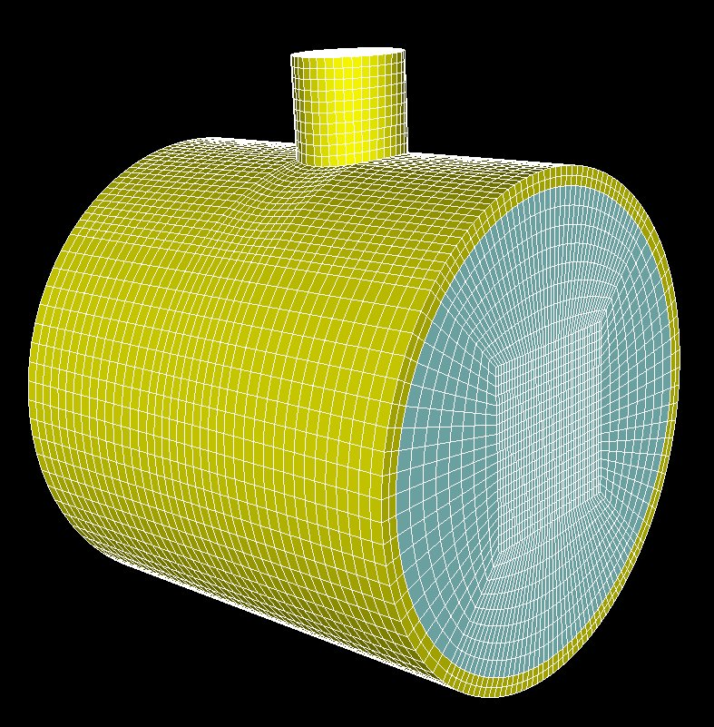

Vue de l'intérieur suivant 3 feuillets dans des plans orthogonaux :

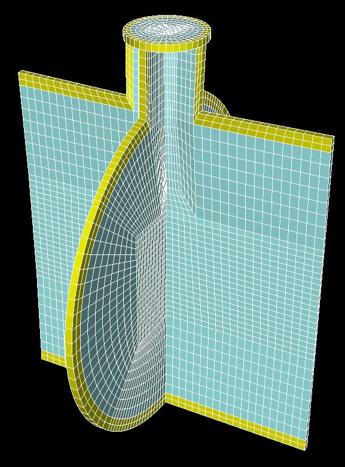

Le script final
***************

Le fichier avec toutes les commandes est disponible :download:`ici <../resources/cylindreOreille.py>`

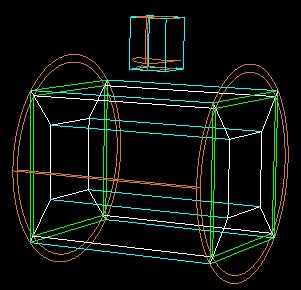

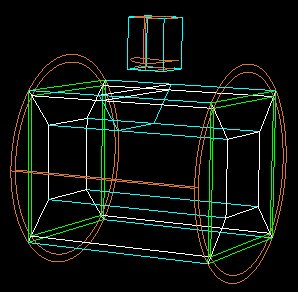

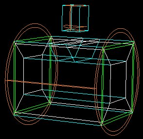

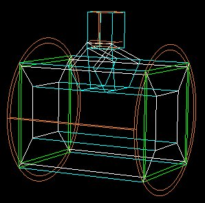

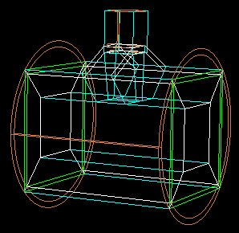
