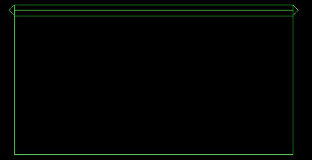
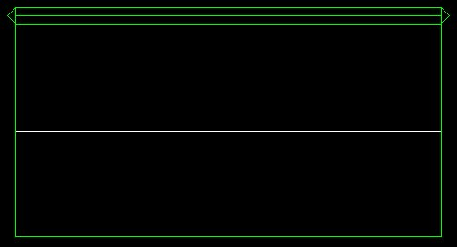
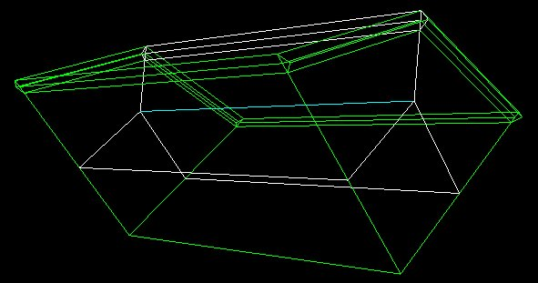
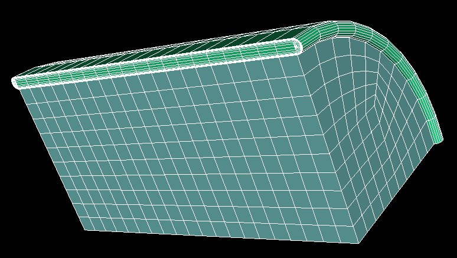

.. _tuto-revolution:

Maillage par révolution d'un modèle 2D
######################################

Pré-requis
**********

Il est préférable d'avoir fait le :ref:`tutorial pour le cas de 2 boites conformes<tuto-2BoitesConformes>`.

Nous avons un modèle 2D construit à l'aide de Magix. Ce modèle est constitué d'un ensemble de zones structurées. 
Le fichier MDL : :download:`mdl <../resources/cylindreOr.mdl>`

Il est à noter que les demi-cercles ont été coupés en deux, ce qui ne change rien pour les cas 2D mais qui est préférable pour les projections en 3D. 

Importation du modèle 2D
************************

La commande est accessible dans le menu *Session/Importer...*
Sélectionner ensuite le fichier *cylindreOr.mdl* (vous pouvez entrer le nom avec le chemin complet dans le champ *File name*).
Valider ensuite avec l'option par défaut *Importer la topologie*.

Si vous n'affichez que les arêtes, vous obtenez ceci :

|cylindreOrAretes2D|

Le panneau *Commandes python* fait alors apparaître la commande suivante : 

.. code-block:: python

  ctx.getTopoManager().importMDL("/xxx/cylindreOr.mdl",False)

Découpage de la topologie pour placer l'o-grid
**********************************************

Pour éviter d'avoir des prismes le long de l'axe avec des maillages structurés par blocs, il est préférable de faire ce que l'on appel une décomposition en O (ou o-grid).
Pour définir la position de l'o-grid en 3D, nous positionnons des arêtes en 2D qui conserveront cette position lors de la création de la topologie 3D.

Il vous faut ouvrir le panneau *Découpage d'une face selon une arête* qui est accessible depuis le panneau *Opérations* en sélectionnant les boutons suivants :

.. taboperation:: 
      :famille: topologie
      :sousfamille: faces
      :operation: découpagefaces

Vous allez ensuite sélectionner les entités pour remplir les champs comme suit :

.. taboperationparams::
      :valeurs: Toutes les faces, Coché
                Arête, Ar0002

Exécuter la commande avec le bouton *Appliquer*.

Le panneau *Commandes python* fait alors apparaître la commande équivalente :

.. code-block:: python

  ctx.getTopoManager().splitAllFaces ("Ar0002", .5, .5)

La topologie des arêtes a maintenant cet aspect :

|cylindreOrAretesSplit|

Cette opération s'apparente à celle faite dans Magix (2D) pour placer le tracé de l'o-grid avant utilisation de la commande revolMdlMesh (script utilisant Bibop3D).

Création de la topologie 3D (et de la géométrie) par révolution
***************************************************************

Il vous faut ouvrir le panneau *Création de blocs par révolution* qui est accessible depuis le panneau 
*Opérations* en sélectionnant les boutons suivants :

.. taboperation:: 
      :famille: topologie
      :sousfamille: blocs
      :operation: blocparrévolution

Vous allez ensuite sélectionner l'entité pour remplir les champs comme suit :

.. taboperationparams::
      :valeurs: Arête, Ar0018

Exécuter la commande avec le bouton *Appliquer*.

Le panneau *Commandes python* fait alors apparaître la commande équivalente :

.. code-block:: python

  ctx.getTopoManager().makeBlocksByRevol (["Ar0018"], Mgx3D.Portion.QUART)

La topologie des arêtes a maintenant cet aspect :

|cylindreOrAretes3D|

Cette opération s'apparente à la commande revolMdlMesh (script utilisant Bibop3D). 

Opérations maillage et sauvegarde
*********************************

Vous pouvez alors lancer les commandes de :ref:`création du maillage<menu-maillage>` et la :ref:`sauvegarde<exporter>` de celui-ci.

Le maillage
***********

Le maillage obtenu a cet aspect:

|cylindreMaillage|

Le script final
****************

Il est alors possible de :ref:`sauvegarder<exporter-script>` l'ensemble des commandes utiles. Le fichier obtenu sera équivalent à ceci : 

.. code-block:: python

  #!/ccc/products/nec/bin/maillage_python
  # -*- coding: iso-8859-15 -*-
  import sys
  sys.path.append("/ccc/products/nec/share/packages")
  import maillage
  import pyMagix3D as Mgx3D
  ctx = Mgx3D.getStdContext()

  # Import Mdl (géom et topo)
  ctx.getTopoManager().importMDL("/cea/BS/home/magix3d/magix3d/tutorial/cylindreOr.mdl",False)
  # Découpage de toutes les faces 2D structurées
  ctx.getTopoManager().splitAllFaces ("Ar0002", .5, .5)
  # Construction Topo et Geom 3D avec o-grid par révolution
  ctx.getTopoManager().makeBlocksByRevol (["Ar0018"], Mgx3D.Portion.QUART)
  # Création du maillage pour tous les blocs
  ctx.getMeshManager().newAllBlocksMesh()
  # Sauvegarde du maillage (mli)
  ctx.getMeshManager().writeMli("cylindreOr.mli")

.. note::
  Pour aller plus loin avec votre cas 2D, il est nécessaire de voir les recommandations générales pour le passage de votre cas 2D au modèle bloc structuré en 3D. 

.. include:: substitution-images.rst

