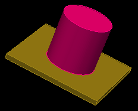
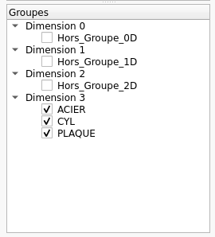

Tutoriel pour mieux comprendre la notion de groupes
###################################################

Cas test
********

Pour illustrer l’intérêt et l'utilisation des groupes, nous allons prendre comme exemple un cylindre et une plaque.

|PlaqueEtCylindre|

Pour les construire, vous pouvez rejouer les 2 commandes suivantes:

.. code-block:: python

  ctx.getTopoManager().newCylinderWithTopo (Mgx3D.Point(0, 0, 0), 1, Mgx3D.Vector(2, 0, 0), 360, True, .5, 10, 10, 10, "CYL")
  ctx.getTopoManager().newBoxWithTopo (Mgx3D.Point(-.2, -2, -2), Mgx3D.Point(0, 2, 2), 10, 10, 10, "PLAQUE")

Les groupes comme matériaux pour le jeu de données
**************************************************

Indépendamment du nom des pièces, un matériau qui sera référencé dans votre jeu de donnés, correspond à un groupe de mailles 
(volume de mailles), et pour regrouper les mailles qui ont les mêmes caractéristiques il est utile de leur attribuer un groupe commun 
(comme avec *Magix* et la notion de *Groupes*).

Pour affecter un/ des volumes à un groupe, il faut sélectionner les boutons suivants:

.. taboperation:: 
      :famille: géométrie
      :sousfamille: volumes
      :operation: geomtogroupe

Ici on souhaite préciser que les deux volumes correpondent à un seul et même matériau *ACIER*, pour cela on modifie les champs suivants et *Appliquer* :

.. taboperationparams::
      :valeurs: Groupe, ACIER
                Opération, Ajouter
                Entités géométriques, Vol0000 Vol0001

La commande équivalente est la suivante : 

.. code-block:: python

  ctx.getGeomManager().addToGroup (["Vol0000", "Vol0001"], 3, "ACIER")

Les opérations disponibles pour cette fonction sont les suivantes :

- **Ajouter** ajoute l'entité à un groupe (qui est créé s'il n'existait pas déjà) et ne modifie pas l'appartenance de l'entité aux autres groupes
- **Enlever** supprime l'entité d'un groupe
- **Affecter** place l'entité dans le groupe et le retire des autres groupes desquels elle faisait partie

La panneau de *Gestion des entités* présente alors les groupes suivants :

|groupes|

Tout ce qui a été fait ici pour les volumes peut également se faire sur les entités de dimensions inférieures, ainsi il est possible 
d'ajouter, enlever ou affecter un groupe pour des surfaces, des courbes ou des points.

Les groupes existent par dimension (0, 1, 2 et 3); on ne peut pas mixer des entités de dimensions différentes dans un groupe.
Si par exemple, on essaie d'affecter une surface au groupe *ACIER* déjà créé (en dimension 3), cela va avoir pour effet de créer un nouveau groupe du même nom mais de dimension 2 qui contiendra la surface en question. 

On peut par contre avoir des élements géométriques et topologiques de dimension identique dans un même groupe (par exemple volumes géométriques et blocs topologiques). Au niveau des entités topologiques, on définit deux types d'appartenance à un groupe :

- explicite : on peut ajouter des entités topologiques à des groupes, avec par exemple la commande :

  .. code-block:: python

    ctx.getTopoManager().addToGroup (["Bl0004"], 3, "MyGroup")

- implicite : une entité topologique associée à une entité géométrique appartient de manière implicite aux groupes auxquels appartient cette entité géométrique. Par exemple après la commande suivante:

  .. code-block:: python

    ctx.getTopoManager().newCylinderWithTopo (Mgx3D.Point(0, 0, 0), 1, Mgx3D.Vector(2, 0, 0), 360, True, .5, 10, 10, 10, "CYL")

  le bloc *Bl0000* (comme tous les autres blocs créés) appartient de manière implicite au groupe *CYL* et à l'écriture du maillage, les mailles créées dans ce bloc appartiendront au groupe *CYL* .

.. warning::

    Dans le cas d'une appartenance implicite, il impossible de d'enlever l'entité topologique du groupe, que ce soit par une commande de type *Enlever* ou de type *Affecter* (qui supprime toute autre appartenance).
    Le seul moyen de jouer sur cette appartenance implicite est de modifier le groupe auquel appartient l'entité géométrique ou l'association du bloc avec l'entité géométrique. 

 
Les groupes comme outils de travail dans Magix3D
************************************************

Dans l'étape précédente, la séparation en 2 groupes (*CYL* et *PLAQUE*) des 2 volumes est déjà un bon moyen de limiter le nombre d'entités 
affichées ce qui s'avère nécessaire pour les cas complexes. C'est faisable en cochant/décochant les groupes qu'on souhaite afficher dans le *Gestionnaire d'entités*.

Néanmoins, il peut s'avérer nécessaire de ne travailler que sur une partie des blocs d'un volume. Pour simplifier ce travail, il est alors possible de mettre ces blocs 
dans un groupe. Pour cela sélectionner les boutons suivants :

.. taboperation:: 
      :famille: topologie
      :sousfamille: blocs
      :operation: topotogroupe

Par exemple, ajoutons le bloc central du cylindre au groupe *CENTRE_CYL*, avec la commande :

.. code-block:: python

  ctx.getTopoManager().addToGroup (["Bl0004"], 3, "CENTRE_CYL")

Notre bloc *Bl0004* n'appartient explicitement qu'à un unique groupe *CENTRE_CYL* mais si on le maille, les volumes de mailles créées seront dans les groupes *CENTRE_CYL*, 
*CYL* et *ACIER* car le bloc est associé au volume *Vol0000* qui appartient lui-même aux groupes *CYL* et *ACIER*.

.. note::

  Les groupes de mailles ainsi créés apparaitront dans le maillage obtenu. Si c'est problématique pour les codes de simulation utilisant le maillage, il faut annuler la création du maillage,
  enlever le bloc du groupe avant de refaire le maillage (ou bien, supprimer la commande d'ajout du bloc au groupe dans le script sauvegardé puis de le rejouer).

Tout ce qui a été fait ici pour les blocs peut également se faire sur les entités de dimensions inférieures, ainsi il est possible d'ajouter, 
enlever ou affecter un groupe pour des faces, des arêtes ou des sommets.

.. note::
  En résumé, l'utilisation des groupes au niveau géométrique et/ou topologique permet de créer ensuite les groupes de mailles de même nom et/ou de filtrer l'affichage des entités à l'écran. 
  Il peut s'appliquer aux entités géométriques et/ou aux entités topologiques.

