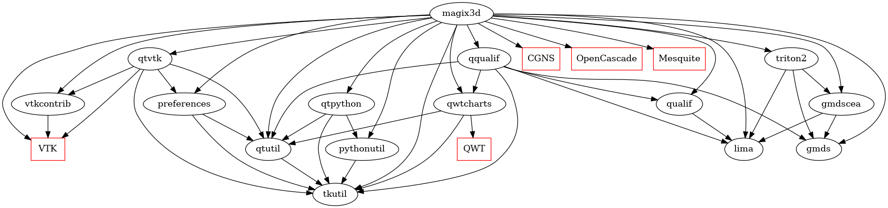

# magix3d


<p align="center"></p>

Magix3d, is an interactive software dedicated to block-structured hex meshing. It provides many interactive tools to design blocks. It also give access to basic functionalities to build CAD models.

This project is part of the [magix3d](https://github.com/LIHPC-Computational-Geometry/magix3d) ecosystem and conforms to its [CI policy](https://github.com/LIHPC-Computational-Geometry/spack_recipes#development-in-magix3d-ecosystem-projects).

The following graph shows the dependencies between magix3d and other LIHPC-CG projects. The red square nodes are external products: they are downloaded, built and installed in [`cmake-cgcore`](https://github.com/LIHPC-Computational-Geometry/spack_recipes/pkgs/container/cmake-cgcore) docker image (not with `apt install`). The black round nodes are LIHPC-CG projects.

This graph is built from the explicit Cmake dependencies specified in the `ci` presets of each project (see `CMakePresets.json` file).




## Magix3d container

**Prerequisite:** `podman` or `docker` is installed on your system.

**Note:** On Windows platforms install podman on your WSL Linux rather than directly on the Windows system to prevent from display connection problem.

Want to test **magix3d** ? Just:

1. Download image
```shell
podman pull ghcr.io/lihpc-computational-geometry/spack-magix3d:latest
```
2. Launch container
```shell
podman run -v /tmp/.X11-unix:/tmp/.X11-unix -e DISPLAY=$DISPLAY --device /dev/dri ghcr.io/lihpc-computational-geometry/spack-magix3d:latest
```

## Local development procedure

The current **magix3d** version relies on [Spack](https://spack.io/) for the installation procedure and is limited to
run on *ubuntu 22.02*. 

### Installing the spack environment
In order to install magix3d and its dependencies on ubuntu 22.02, you can open a terminal and run the next command 
lines (see https://github.com/LIHPC-Computational-Geometry/spack_recipes/blob/main/build_spack.sh):

```shell
#==========================================
#get spack engine
git clone --depth=1 -b v0.20.1  https://github.com/spack/spack.git
#==========================================
#get CEA LIHPC meshing recipes
git clone https://github.com/LIHPC-Computational-Geometry/spack_recipes.git
#==========================================
# configure spack engine with our recipes
cp ./spack_recipes/config/packages.yaml ./spack/etc/spack/
source ./spack/share/spack/setup-env.sh
spack repo add ./spack_recipes/meshing
spack repo add ./spack_recipes/meshing_supersede
spack compiler find
spack external find cmake
#==========================================
# to compile and develop within magix3d
git clone git@github.com:LIHPC-Computational-Geometry/magix3d.git
spack dev-build -d ./magix3d magix3d@2.2.7 ^vtk-maillage~opengl2+qt~mpi ^hdf5~mpi ^cgns~mpi ^mesquite~mpi
```
**Remark:** *Spack stores some data in your home (see `~/.spack`). If you use spack for installing 
multiple libraries and software, it can be necessary to delete this directory to avoid conflicts
during the installation procedure.*

Just a few word to explain the previous command lines:
1. The first line downloads the version of spack we rely on. 
2. The second line downloads the specific spack recipes we have for our meshing projects.
3. The third block of lines configures spack for installing *magix3d* on your computer. When it is done, check that a c++ compiler was found.
4. Eventually, the last block of lines clones *magix3d* source code and install it locally with the specified variants.

### Development with clion
There are many options to develop with **clion**. We just provide one here. The last command of the previous
script has compiled the magix3d source code into `magix3d/`. In particular, it has generated the file named 
`magix3d/spack-build-env.txt`. You are going to source this file in a terminal, and then run clion from this terminal.

When opening `magix3d` in clion, you will then have to add some compilation flags. For development purpose, we advise
to use the following ones:
```shell
-DUSE_PYTHON_3=ON -DWITH_DOC=OFF -DWITH_COV=ON
```
With this CMake options, you may get two CMake targets:
- `test_link` that runs the python test suite, that is located in `test_link/` directory. This target requires to find the program `pytest`
- `code_cover` that runs the code coverage. The code coverage requires only to build the target and not to run it. This target requires to find the program `lcov`. Once ran, it will generate a html report that will be located in you build directory in `code_cover\index.html`.

