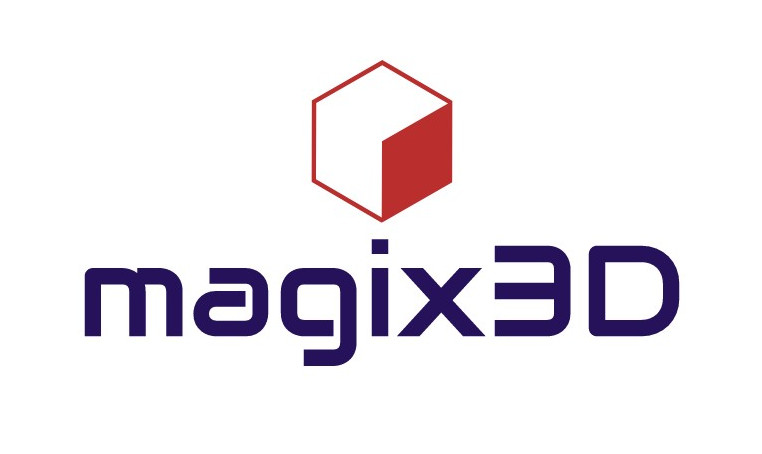

# magix3d

Magix3d, is an interactive software dedicated to block-structured hex meshing. It provides many interactive tools to design blocks. It also give access to basic functionalities to build CAD models.

This project is part of the [magix3d](https://github.com/LIHPC-Computational-Geometry/magix3d) ecosystem and conforms to its [CI policy](https://github.com/LIHPC-Computational-Geometry/spack_recipes#development-in-magix3d-ecosystem-projects).

The following graph shows the dependencies between magix3d and other LIHPC-CG projects. The red square nodes are external products: they are downloaded, built and installed in [`cmake-cgcore`](https://github.com/LIHPC-Computational-Geometry/spack_recipes/pkgs/container/cmake-cgcore) docker image (not with `apt install`). The black round nodes are LIHPC-CG projects.

This graph is built from the explicit Cmake dependencies specified in the `ci` presets of each project (see `CMakePresets.json` file).

